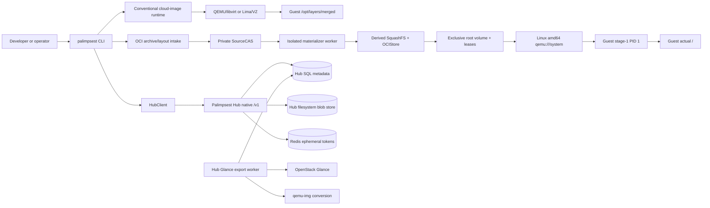

# Palimpsest Architecture

## Overview

Palimpsest Local은 검증된 cloud image, SquashFS layer, OCI-layout bundle을 로컬에서 보관하고, 선언형 VM 프로젝트와 OCI-root 실행을 제공하는 독립 Python CLI다. 로컬 패키지(`palimpsest-local`)의 repository는 [openstack-afterglow/palimpsest](https://github.com/openstack-afterglow/palimpsest)이며 이 문서는 `codex/oci-root-phase1` 작업트리를 기준으로 작성했다. 일반 패키지 버전은 `palimpsest-local 0.1.0.dev0`(`pyproject.toml`), 별도 Hub 패키지는 `palimpsest-hub 0.1.0`(`hub/pyproject.toml`)이다.

1분 요약:

- `src/palimpsest_local/cli.py:main`이 artifact, registry, build, VM, compose 명령을 분기한다.
- conventional cloud-image runtime은 immutable `qcow2`/`raw` base와 read-only SquashFS layers를 QEMU/libvirt 또는 Lima에 붙이고, guest의 `/opt/layers/merged`에 OverlayFS를 만든다.
- OCI-root runtime은 로컬 OCI archive/layout을 snapshot하고 private source CAS, 격리된 SquashFS 변환, exclusive root volume을 거쳐 Linux amd64 KVM guest의 실제 `/`로 전환한다.
- `hub/`는 별도 배포 단위인 native `/v1` artifact API와 Glance export worker다. Hub는 Docker/OCI `/v2` registry가 아니다.

## Development status

구현 상태와 검증 수준은 분리한다. 2026-09-08 아키텍처 정리 시 portable lane manifest 검사와 합쳐진 작업트리의 `core-cli` 1025건, architecture guard focused 13건이 통과했다. 이후 `c95d948`의 서버 관련 검사 567건·real packer 3건과 기존 빌드 이미지의 cold public exec 1건이 통과했다. 같은 SHA의 원본 Redis는 변환 뒤 stage-1 filesystem 검증에서 실패했다. 아래 현재 checkpoint와 역사적 qualification을 구분하며 전체 suite·Gate 2 재통과를 뜻하지 않는다.

| 기능 | Implementation | Verification evidence | Current limit | Source |
| --- | --- | --- | --- | --- |
| 로컬 artifact store와 XDG state | implemented | source-reviewed, test-defined | 같은 UID가 state를 악의적으로 다시 쓰는 OS sandbox는 아님 | [`state.py`](src/palimpsest_local/state.py), [`artifact_store.py`](src/palimpsest_local/artifact_store.py), [`tests/unit/test_state.py`](tests/unit/test_state.py) |
| conventional cloud-image VM | implemented | source-reviewed, test-defined | backend별 host 도구가 필요하고 root pivot은 하지 않음 | [`cloud_runtime.py`](src/palimpsest_local/cloud_runtime.py), [`lima.py`](src/palimpsest_local/lima.py), [`tests/unit/test_cloud_runtime.py`](tests/unit/test_cloud_runtime.py) |
| `palimpsest.yml` multi-VM reconcile | implemented | source-reviewed, test-defined | strict subset; Linux KVM port publishing과 shared writer는 거부 | [`project_runtime.py`](src/palimpsest_local/project_runtime.py), [`project.py`](src/palimpsest_local/project.py), [`tests/unit/test_project_runtime.py`](tests/unit/test_project_runtime.py) |
| OCI local archive/layout intake | implemented | source-reviewed, test-defined | source는 로컬 archive/layout만 받으며 registry reference를 직접 받지 않음 | [`oci_source.py`](src/palimpsest_local/oci_source.py), [`tests/unit/test_oci_source.py`](tests/unit/test_oci_source.py) |
| OCI layer materialization | implemented | source-reviewed, test-defined | Linux amd64와 qualified `mksquashfs` 경계; warm cache hit도 source authority를 우회하지 않음 | [`oci_materializer.py`](src/palimpsest_local/oci_materializer.py), [`oci_materializer_worker.py`](src/palimpsest_local/oci_materializer_worker.py), [`tests/unit/test_oci_converter_first_pass.py`](tests/unit/test_oci_converter_first_pass.py) |
| OCI-root public KVM lifecycle | partial | source-reviewed, test-defined | `qemu:///system`, Linux x86_64, explicit host proof와 no-network만 지원; recovery/other architectures는 별도 gate | [`oci_run_adapter.py`](src/palimpsest_local/oci_run_adapter.py), [`oci_root_runtime.py`](src/palimpsest_local/oci_root_runtime.py), [`tests/unit/test_oci_run_adapter.py`](tests/unit/test_oci_run_adapter.py), [`tests/kvm/test_oci_public_cli_live.py`](tests/kvm/test_oci_public_cli_live.py) |
| OCI-root explicit run user | implemented | source-reviewed; focused/native 결과는 별도 기록 | `--user USER[:GROUP]`만 허용하며 capability 추가·argv/env/cwd override·자동 소유권 변경은 없음 | [`oci_run_request.py`](src/palimpsest_local/oci_run_request.py), [`oci_boot_plan.py`](src/palimpsest_local/oci_boot_plan.py), [user contract](docs/oci-run-user.md) |
| guest stage-1 root transition와 PID 1 | implemented | source-reviewed, test-defined | production host lifecycle와 hostile-root availability 보장은 아님 | [`guest/stage1/init.c`](guest/stage1/init.c), [`guest/stage1/README.md`](guest/stage1/README.md), [`tests/kvm/test_oci_guest_stage1_live.py`](tests/kvm/test_oci_guest_stage1_live.py) |
| native Hub `/v1` upload/download/bundle | implemented | source-reviewed, test-defined | native `/v2` registry protocol은 없음 | [`hub/src/palimpsest_hub/api/hub.py`](hub/src/palimpsest_hub/api/hub.py), [`hub/tests/test_hub_api.py`](hub/tests/test_hub_api.py) |
| Hub Glance export worker | partial | source-reviewed, test-defined | OpenStack/DB/Redis와 qemu-img 전제가 있는 비동기 worker; worker 자체의 live 실행은 별도 운영 검증 | [`hub/src/palimpsest_hub/services/image_exports.py`](hub/src/palimpsest_hub/services/image_exports.py), [`hub/src/palimpsest_hub/worker.py`](hub/src/palimpsest_hub/worker.py), [`hub/tests/test_image_exports.py`](hub/tests/test_image_exports.py) |
| direct Docker Hub → `run` intake | not-implemented | source-reviewed, test-defined | Skopeo 등 외부 도구로 digest-preserving OCI archive를 만든 뒤에만 local OCI 경계로 들어감 | [`oci_source.py`](src/palimpsest_local/oci_source.py), [`docs/oci-docker-hub-compatibility.md`](docs/oci-docker-hub-compatibility.md) |

`162cebe` 진단 checkpoint: exact-SHA 서버 집중 검사 198건과 전용 게스트 native 43 boots / 44 QEMU proof가 통과했다. 당시 원본 Redis 실기는 실패했고, 고정 로그가 root-owned `/proc`0555와 exact0755 검사 충돌을 확인했다. entrypoint는 실행되지 않았다. 후속 사용자 승인에 따라 `/proc`에만 0555를 추가 허용하는 구현을 반영하며, 해당 수정의 native 결과는 별도로 검증한다. PID 1 보호는 유지한다. 이전 기존 빌드 이미지의 cold public exec 성공을 새 게스트 검증·전체 Gate 2·일반 이미지 호환성 완료로 확대하지 않는다. 자세한 결과는 [compatibility checkpoint](docs/oci-docker-hub-compatibility.md)에 기록한다.

후속 `d9b3593`의 로컬·exact-SHA 서버 집중 검사 각209건과 전용 native43 boots /44QEMU proof가 통과했다. 원본 Redis는 공개 `run -d`와 실제 `/` 전환·workload 시작까지 진행했으나 entrypoint의 `setpriv` capability 유지 요청이 거부돼 status1로 종료했다. 서비스 readiness 및 이후 service exec/root/PID1 비교 검사는 미통과다. 실패 domain 이름이 남아 기존 cold exec의 empty-domain preflight를 중단했지만, 추가 조회에서 guest는 이미 `shut off`이고 inactive 등록만 남았음을 확인했다. 독립 승인된 대체 계획으로 해당 등록의 UUID·shut-off·autostart 비활성·활성 VM 없음·원본 해시를 전후 확인했고, 동일 SHA의 별도 기존 빌드 이미지 cold 공개 run/exec/root/PID1 refusal/stop/rm이 통과했다(21.07초). 실패 Redis의 등록·자료는 보존했고 수동 stop/삭제나 PID1/workload 권한 추가는 하지 않았다.

`IMPLEMENTATION_PLAN.md`, [`docs/oci-public-runtime-roadmap.md`](docs/oci-public-runtime-roadmap.md), [`docs/oci-docker-hub-compatibility.md`](docs/oci-docker-hub-compatibility.md), 그리고 [`tracking/afterglow-palimpsest.json`](tracking/afterglow-palimpsest.json)은 각각 역사적 계획/qualification 기록 또는 Afterglow baseline 계약이다. 이 문서는 해당 파일의 완료 주장이나 hash를 재작성하지 않으며, 현재 소스와 테스트 정의가 우선한다.

## System context

`cc1fca7` 표준 I/O 실기 진단: 로컬·정확한 서버 SHA 집중 검사 각113건과 UID0/101 전용 native 2건(30.54초)이 통과했다. 실제 main console과 추가 exec pipe는 root-owned0600이며, 상속 FD 쓰기는 모두 성공하지만 UID101의 self-FD pathname 재열기는 EACCES였다. 표준 스트림 별칭은 없고 PID1 보호·capability0·NNP/seccomp·인증된 실제 root 비교는 유지됐다. 기존 실패 VM3개와 archive4개 해시 보존 및 새 진단 VM의 정상 정리를 확인했다. 앞선 테스트 C 컴파일 실패도 보존한다. 이 진단은 guest 구현 변경·원본 NGINX 성공·새 application build·전체 Gate2가 아니다. [실측 결과와 다음 경계](docs/oci-linux-process.md)를 참고한다.

`866d5e6` Linux ArgsEscaped checkpoint: 로컬 집중661건 통과·Linux 전용1skip, 정확한 서버 SHA에서662건 모두 통과했다. 원본 NGINX는 intake와 root 전환·entrypoint 실행을 지났으나 error.log 열기 권한 오류로 종료해 실기는 실패했다(20.71초). 보존 lower의 로그 symlink는 `/dev/stderr`·`/dev/stdout`을 가리키고 현재 게스트의 전용 `/dev`에는 해당 경로가 없어 후속 계약 검토 대상이다. 이는 소스 기반 설명이며 symlink 추가의 해결 효과는 미검증이다. 새 NGINX와 기존 Redis의 inactive 등록·자료 및 원본 해시는 보존한다. [상세 결과와 미완료 경계](docs/oci-linux-process.md)를 참고하며 NGINX readiness·public root/PID1 비교·전체 Gate2 성공으로 확대하지 않는다.

같은 SHA의 별도 기존 빌드 이미지 cold 회귀도 host ancestor 재검증 오류로 실패했다(5.51초). 어느 경로/필드가 변했는지는 미확정이며 기존 verifier를 수정하거나 재시도로 숨기지 않았다. 새 `exec-cli`까지 세 inactive 등록과 실패 자료를 보존하고 활성 VM 없음·원본 해시 불변을 확인했다. 이번 cold 성공이나 전체 Gate2 재통과를 주장하지 않는다.

`4cbc863`의 명시적 `run --user` 후속 checkpoint: 관련 13개 모듈의 로컬·서버 검사 각1,057건이 통과했다. 원본 Redis 아카이브의 별도 `--user redis` 실기는 통과(28.05초)했고 UID999/GID1000·capability0·NNP1/seccomp2·실제 root 비교·PID1 거부·stop/rm을 확인했다. 같은 SHA의 기존 빌드 이미지 기본 cold exec도 통과(20.68초)했다. 원본 기본 Redis 실패와 기존 inactive 등록·자료는 보존하며, 새 build·전체 Gate2·직접 registry intake 성공으로 확대하지 않는다. 상세 근거는 [compatibility checkpoint](docs/oci-docker-hub-compatibility.md)에 있다.

2026-09-09 후속 진단은 `oci_host.verify_runtime_parent`의 기존 거부 조건과 syscall 순서를 유지하며 `post-acl` / `final-identity` / `final-stamp`, root 기준 depth, 변경된 필드 이름만 제한된 오류에 덧붙인다. 경로·metadata 값은 출력하지 않으며 ACL/ctime 검사 완화·재시도·게스트 변경은 없다. 이 관측성 변경은 이전 cold 실패의 원인 확정이나 재통과가 아니다. [표준 I/O 경로 검토](docs/oci-linux-process.md)는 별칭과 FD 재열기 권한을 구분하며 아직 게스트 allowlist를 변경하지 않는다. 검증 범위는 [focused host diagnostic loop](docs/testing.md)에 분리한다.

Palimpsest 안에는 서로 다른 실행/저장 경계가 있다. conventional runtime과 OCI-root runtime은 같은 `run` 명령 계층을 공유할 수 있지만, cloud-image base와 OCI source graph를 같은 artifact로 취급하지 않는다.



텍스트 흐름: 사용자가 CLI로 로컬 base/layer를 선택하면 conventional 경로는 base overlay와 layer disks를 hypervisor에 투영하고 guest가 `/opt/layers/merged`를 활성화한다. OCI 경로는 archive/layout의 descriptor graph를 한 번 snapshot한 뒤 source CAS를 재사용하고, 각 layer occurrence를 derived SquashFS로 변환하여 lease와 root volume을 준비한 다음 stage-1이 인증한 root를 `/`로 이동한다. Hub 요청은 Keystone token으로 native `/v1`에 도착하며 SQL metadata, 파일 blob, ephemeral Redis token이 분리된다. Hub worker는 SQL job을 polling하여 Glance image를 qemu-img로 변환하고 blob store에 publish한다.

형제 서비스는 이 저장소의 import 대상이 아니다. Afterglow는 별도 dashboard/BFF, Drover는 K3s control plane, Lumen은 chat runtime, Waygate는 gateway control plane이며, Palimpsest는 이들을 내부 모듈로 가져오지 않는다.

## Code map

| 영역 | 주요 경로와 심볼 | 책임과 의존 방향 |
| --- | --- | --- |
| CLI와 routing | [`cli.py`](src/palimpsest_local/cli.py)의 `main`, `resolve_local_oci_run_request`; [`runtime_dispatch.py`](src/palimpsest_local/runtime_dispatch.py) | argparse surface와 typed `RuntimeKind`/`RuntimeBackend`를 결정하고 cloud-image, Lima, OCI adapter로 분기 |
| local state | [`state.py`](src/palimpsest_local/state.py)의 `StatePaths`, `reserve_new_run`, `locked_existing_run`, `atomic_write_json` | owner-only XDG roots, run/project ledgers, lock과 atomic publication. runtime adapter가 이 경계를 소비 |
| conventional runtime | [`cloud_runtime.py`](src/palimpsest_local/cloud_runtime.py)의 `create_run`, lifecycle operations; [`lima.py`](src/palimpsest_local/lima.py); [`project_runtime.py`](src/palimpsest_local/project_runtime.py)의 `up_project`/`down_project` | verified cloud image와 layers를 KVM/libvirt 또는 Lima/VZ에 연결하고 compose-shaped project를 reconcile |
| OCI source | [`oci_source.py`](src/palimpsest_local/oci_source.py)의 `LocalLayoutSource`, `LocalArchiveSource`, `SourceCAS`, `SnapshottedOCIImage` | no-follow snapshot, descriptor/digest 검증, source bytes를 private CAS에 고정 |
| OCI conversion/store | [`oci_materializer.py`](src/palimpsest_local/oci_materializer.py)의 `materialize_image_hard`; [`oci_store.py`](src/palimpsest_local/oci_store.py)의 `DerivedSquashFSKey`, `DerivedLayerReceipt`, lease APIs; [`artifact_store.py`](src/palimpsest_local/artifact_store.py)의 `ArtifactStore` | worker deadline/resource boundary 안에서 normalized tar → SquashFS를 만들고 derived recipe, record, artifact, occurrence를 관리 |
| OCI root preparation | [`oci_root_prepare.py`](src/palimpsest_local/oci_root_prepare.py)의 `prepare_oci_root_run`, `release_oci_root_transaction`; [`oci_root_volume.py`](src/palimpsest_local/oci_root_volume.py) | lower lease와 VM-exclusive ext4 root volume을 durable transaction으로 claim/release; retained root는 별도 identity로 재사용 |
| OCI host/monitor | [`oci_run_adapter.py`](src/palimpsest_local/oci_run_adapter.py)의 `run_local_oci`, `stop_oci_run`, `rm_oci_run`; [`oci_root_runtime.py`](src/palimpsest_local/oci_root_runtime.py); `oci_monitor_*` | explicit `qemu:///system` domain, ACL/export, monitor handshake, STOP/TERMINAL과 exact cleanup을 연결 |
| guest boundary | [`guest/stage1/init.c`](guest/stage1/init.c), [`src/palimpsest_local/oci_guest_stage1.py`](src/palimpsest_local/oci_guest_stage1.py), [`src/palimpsest_local/oci_lifecycle_transport.py`](src/palimpsest_local/oci_lifecycle_transport.py) | authenticated root/lower block을 read-only 정책으로 확인하고 OverlayFS를 `/`로 move-mount-chroot한 뒤 PID 1이 workload와 lifecycle protocol을 감독 |
| Hub API | [`hub/src/palimpsest_hub/main.py`](hub/src/palimpsest_hub/main.py), [`hub/src/palimpsest_hub/auth.py`](hub/src/palimpsest_hub/auth.py), [`hub/src/palimpsest_hub/api/hub.py`](hub/src/palimpsest_hub/api/hub.py) | `/v1` discovery/health, Keystone token scope, layer/image query, resumable upload, bundle, image-export API |
| Hub persistence/ops | [`hub/src/palimpsest_hub/models.py`](hub/src/palimpsest_hub/models.py), [`hub/src/palimpsest_hub/services/hub_store.py`](hub/src/palimpsest_hub/services/hub_store.py), [`hub/src/palimpsest_hub/services/image_exports.py`](hub/src/palimpsest_hub/services/image_exports.py), [`hub/src/palimpsest_hub/worker.py`](hub/src/palimpsest_hub/worker.py) | SQL rows와 filesystem blobs를 source of truth로 유지하고 worker lease/conversion/GC를 수행 |

의존 방향은 `cli → typed request → source/store 또는 runtime adapter`이며, Hub client는 독립 HTTP 경계다. Hub package는 local package의 Python 모듈을 import하지 않는다.

OCI `run --user`는 `OCIUserSpec.from_override_value`에서 빈 값 없는 이름/숫자와 선택 group으로 파싱하고 `LocalOCIRunRequest.user_override`로 전달한다. adapter → root preparation → boot intent가 typed override를 보존한다. `OCIProcessSpec.with_user`는 user만 바꾸며 materialization receipt의 원본 process는 수정하지 않는다. cloud-image 요청은 runtime stack 해석·실행 전에 거부한다.

명시적 user 값은 숫자 변환 전에 65문자로 제한해 과대 입력도 일반 검증 오류로 거부한다. `user_override`는 request의 마지막 필드여서 기존 positional 인자 순서를 보존한다. v3 schema는 문자열 및 지원 version을 확인한 뒤 exact-field 검증으로 진행하며 list/dict 값도 `StateError`로 거부한다. 원본 Redis 기본 proof와 새 `REDIS_USER` proof는 독립 opt-in이며 후자는 원본/실행 process 대조, 실제 non-root UID/GID와 capability/NNP/seccomp, root/PID1 비교를 별도 검사한다.

Linux process parser는 legacy `ArgsEscaped`의 absent/null/strict boolean을 허용하고 boolean 값과 무관하게 원본 Entrypoint+Cmd 벡터를 그대로 전달한다. 숫자·문자열·배열·객체는 거부하며 shell 삽입·인자 분할·unescape는 없다. `oci_image.py`의 기존 Linux amd64 gate와 source config descriptor/CAS bytes/snapshot identity를 보존한다. canonical process가 같더라도 원본 config digest는 다를 수 있다. Windows 지원·process/boot-plan schema·recipe·게스트 C/ELF·PID 1 및 workload 보호 변경은 없다. 자세한 근거와 제한은 [Linux process metadata](docs/oci-linux-process.md), 선별 검사와 독립 NGINX native 경계는 [testing](docs/testing.md)에 있다.

## Runtime flows

### Conventional cloud-image flow

`image import/pull`이 검증된 `qcow2` 또는 `raw` base를 local content store에 둔다. `cloud_runtime` 또는 `lima`는 실행마다 writable qcow2 overlay를 만들고 base는 read-only로 유지한다. layer SquashFS는 KVM의 `vdb..vdz` read-only virtio disks 또는 Lima guest 복사본으로 전달된다. NoCloud/cloud-init이 guest에서 layer disks를 `/mnt/palimpsest/lowerN`에 mount하고 leaf → root 순서의 OverlayFS를 `/opt/layers/merged`에 만든다. `exec`, `shell`, `logs`, `stop`, `rm`은 owner ledger와 backend identity를 재확인한다. Linux KVM의 project `ports`는 현재 안전한 forwarding 경계가 없어 거부되며, Lima는 static TCP forwarding만 제공한다.

### OCI-root materialize → run flow

1. `LocalArchiveSource` 또는 `LocalLayoutSource`가 `oci-layout`, `index.json`, manifest, config, compressed layer descriptor를 안전하게 읽고 하나의 `SnapshottedOCIImage`와 `source_snapshot_binding_digest`를 만든다. 자동 root 선택은 정확히 하나일 때만 허용한다.
2. `SourceCAS`가 원본 descriptor bytes를 private owner-only CAS에 저장한다. `materialize_image_hard`는 occurrence마다 `DerivedSquashFSKey`를 구성하고 worker를 새 process group으로 실행한다. deadline, bounded JSON, resource limit과 process-group reap이 실패 경계를 이룬다.
3. `OCIStore`는 source compressed digest/DiffID와 conversion policy/toolchain을 recipe identity로 보존하고, derived `.sqsh` byte digest 및 record를 publish한다. 같은 content의 반복 occurrence도 논리 ordinal은 유지한다.
4. `prepare_oci_root_run`은 lower lease set과 run-exclusive ext4 root volume을 durable transaction으로 claim한다. BOOT/lower export를 publish하고 domain plan을 commit한 뒤 inactive domain을 define하며, 그 다음 monitor binding을 준비하고 runtime/ACL grants를 적용한 뒤 monitor를 활성화한다.
5. `run_local_oci`는 qualified `qemu:///system`에서 monitor coordinator를 시작하고 READY를 기다린다. foreground는 workload/console 결과를 기다리고, `-d`는 authenticated READY 이후 이름만 반환한다. INT/TERM은 monitor STOP을 요청한다.
6. stage-1 PID 1은 authenticated BOOT/plan과 block identity/filesystem geometry를 확인하고 read-only lowers + ext4 upper로 OverlayFS를 조립한다. `MS_MOVE`와 `chroot(2)`를 이용해 `/`로 전환하며 `pivot_root(2)`를 호출하지 않는다. 이후 workload를 private cgroup와 seccomp/no-new-privs 경계에서 감독한다.
7. `stop`/`rm`은 exact run/domain/monitor identity, terminal state, ACL revocation, lower lease, root volume release를 확인한 뒤 state tree를 제거한다. retain 정책은 VM-exclusive root volume만 보존하며 shared data volume이 아니다.

### Native Hub flow

`HubClient`는 Keystone token을 `X-Auth-Token`으로 보내 `/v1/images`, `/v1/layers`, `/v1/uploads`, `/v1/bundles`를 호출한다. upload는 `POST → PATCH(Upload-Offset) → PUT`으로 이어지고 Hub가 수신 bytes의 digest를 다시 계산한다. SQL은 upload/session 및 layer/export metadata를 보존하고 filesystem blob store는 실제 bytes를 보존한다. bundle은 complete parent chain을 OCI image-layout tar로 내보내거나 받은 tar의 각 blob digest를 재검증한다. `/v1/image-exports` 요청은 project-scoped Glance image를 SQL job으로 남기며 worker가 lease를 claim하고 download/conversion/finalizing 단계를 거쳐 blob을 publish한다. Redis는 짧은 수명의 download token cache이며 작업/metadata의 정본이 아니다.

## Data and contracts

### 정본과 cache 분리

| 데이터 | authoritative storage | cache/파생물 | 불변식 |
| --- | --- | --- | --- |
| local config와 run/project state | `${XDG_CONFIG_HOME}/palimpsest`, `${XDG_STATE_HOME}/palimpsest/{runs,projects,volumes,locks}` | 없음 | owner-only mode, no-follow read, atomic ledger와 lock |
| local generic artifact bytes | `store/blobs/sha256/<hex>`와 metadata | tags, transfer records | byte digest 검증 후 publish; base는 read-only |
| OCI source bytes | run/operation에 지정된 private `SourceCAS` | snapshot binding | descriptor size/digest와 CAS identity를 함께 검증 |
| OCI derived runtime block | `OCIStore`의 derived record와 `ArtifactStore` `.sqsh` bytes | `DerivedSquashFSKey`, warm hit | packer/policy/toolchain까지 recipe identity에 포함; receipt는 source graph와 store에 binding |
| Hub layer/upload metadata | Hub SQL `palimpsest_hub_layers`, `palimpsest_hub_uploads` | Redis는 없음 | project visibility, parent chain, media type, `Upload-Offset`와 digest 검증 |
| Hub blob payload | `palimpsest_hub_local_path` filesystem/PVC | temporary upload staging | 최종화 때 SHA-256/size/MD5를 계산하고 metadata와 일치시킴 |
| image export job | Hub SQL `palimpsest_image_exports` | Redis download token TTL 60초 | lease owner/expiry, status와 artifact key로 중복 변환을 막음 |

### Identity와 contract

- OCI manifest digest는 선택된 source manifest/index descriptor의 identity다. OCI compressed layer digest와 uncompressed `DiffID`는 서로 대체할 수 없다.
- `.sqsh`의 SHA-256은 derived runtime bytes의 identity다. archive tar SHA-256은 transport identity이고 manifest digest와 다르다.
- `DerivedSquashFSKey.digest`는 compressed digest, size, DiffID, normalization/tar/pack policy, packer version/executable/dependency digest와 structural verifier를 포함한 recipe/cache identity다.
- [`oci_packer.py:verify_squashfs_fd`](src/palimpsest_local/oci_packer.py)의 구조 검증은 `palimpsest.squashfs-superblock.v3`다. fragment가 0개이면 기존 범위 검사를 통과한 유한 table offset 또는 미사용 sentinel을 허용하고, 1개 이상이면 table이 있어야 한다. 필수 table·범위·root 위치·padding 검사는 유지한다. v3는 기존 recipe/receipt에 반영돼 v2와 다른 cache key를 만들며 이전 기록을 삭제하거나 자동 변환하지 않는다.
- 같은 fragment 규칙을 [`oci_guest_filesystems.py`](src/palimpsest_local/oci_guest_filesystems.py)의 portable pre-mount 검증과 [`guest/stage1/init.c`](guest/stage1/init.c)의 실제 FD 검증에도 적용한다. host/portable 차등 검사와 실제 C 하네스가 zero/nonzero·필수 table·범위·padding 수락/거부를 따로 확인한다. 배포 ELF는 고정 offline toolchain으로 재생성하고 source/binary provenance digest를 갱신한다. 전체 lower digest·plan/장치 identity·PID 1 보호·capability/seccomp/no-new-privs·자원 정책은 변경하지 않는다. 이 동기화 전 `c95d948`의 Redis는 stage-1 filesystem 거부로 실패했으며 native 재통과는 별도 증거가 필요하다.
- `OCIImageMaterializationReceipt`는 source snapshot binding, source image/manifest/config, ordered layer descriptors/DiffIDs와 결과 receipt를 결합한다. receipt digest는 `.sqsh` bytes digest와 별개다.
- 명시적 user override가 없으면 boot-plan v2 직렬화를 유지한다. override가 있으면 v3의 `process_provenance`에 원본 `image_process`와 `user_override`를 담고, 기존 `process`에는 user만 교체한 실행값을 둔다. preparation decoder는 version별 exact fields와 canonical process/user를 검사하고 실행값을 재계산해 비교한다. 전체 boot-plan digest가 provenance를 포함하고 기존 lease/domain-core/stage-1 binding으로 이어진다. lower graph/cache identity는 바뀌지 않으며 guest C/ELF·계정 해석·권한 제거 경로도 그대로다. 이 호스트 기록은 악의적인 호스트에 대한 외부 attestation이 아니다.
- `run_id`/run name, `OCIRootVolumeRecord.volume_id`와 generation, `ArtifactLeaseOwner`/lease-set ID, libvirt domain UUID, monitor authority는 lifecycle identity다. retained root 재사용은 같은 lower graph/size와 exclusive attachment 조건을 다시 확인한다.
- Hub layer `kind`는 `cloud-image`, `squashfs`, `buildkit-cache`를 구분한다. cloud image는 `disk_format`과 `arch`가 필요하고 parent/chain이 없으며, BuildKit cache는 runtime architecture/parent chain이 없다.
- native Hub `/v1`는 OCI Distribution `/v2` endpoint가 아니다. `palimpsest pull/push` registry wrapper와 `palimpsest image pull/push` Hub artifact 명령도 서로 다른 namespace와 credential path를 가진다.

## Deployment and operations

### 로컬 패키지

- base package는 `palimpsest-local` Python 3.12+이며 필수 runtime dependency가 없다. Linux libvirt는 `[kvm]` extra(`libvirt-python>=10.0.0`)다.
- conventional macOS Apple Silicon은 Lima 2.1+ VZ(`lima-vz`)를 기본으로 사용하고, Linux KVM은 `/dev/kvm`, QEMU, `qemu:///system`, `default` network와 `cloud-localds`, `mksquashfs`, OpenSSH가 필요하다.
- OCI-root public adapter는 Linux x86_64, `/dev/kvm`, `qemu:///system`, qualified kernel/config/packer absolute paths와 digest pins, system libvirt event surface를 요구한다. OCI network는 `none`만 현재 public intake에서 허용한다.
- local state에는 `store/`, `runs/`, `projects/`, `volumes/`, `builds/`, `build-cache/`, `runtime-packs/`, `tags/`, `transfers/`, `oci-root-volumes/`가 있다. `ps`/`inspect`/`logs`는 각각 durable ledger 또는 retained console만 읽는 제한된 관찰 명령이다.

### Hub 배포 단위

Hub는 별도 `hub/` Python package로 배포한다.

```sh
cd hub
uv run palimpsest-hub-bootstrap
uv run palimpsest-hub-migrate-data --source-url "$SOURCE_DATABASE_URL" --destination-url "$DESTINATION_DATABASE_URL"
uv run palimpsest-hub
uv run palimpsest-hub-worker
```

첫 번째 명령은 `Base.metadata.create_all`로 빈 destination schema를 준비하는 bootstrap이다. 두 번째는 source와 destination이 달라야 하며 destination table이 비어 있을 때만 `palimpsest_hub_layers`, `palimpsest_hub_uploads`, `palimpsest_image_exports`를 복사하는 data migration이다. bootstrap과 data migration은 같은 명령이 아니며, migration 뒤 API/worker가 같은 `DATABASE_URL`, `PALIMPSEST_HUB_LOCAL_PATH`, `REDIS_URL`을 사용해야 한다. API entrypoint는 `uvicorn palimpsest_hub.main:app --host 0.0.0.0 --port 8020`이며 `hub/src/palimpsest_hub/main.py`의 `/v1/health`는 process-level `status: ok` 응답이지 SQL/Redis/Glance readiness 증명이 아니다. worker는 qemu-img 지원을 확인한 후 SQL export job을 polling하고 2초 간격으로 idle 대기, 시간당 maintenance를 수행한다.

### 운영 관찰과 실패 경계

API는 401 Keystone validation, 403 system-admin, 404 visibility/ownership, 409 offset/descriptor conflict, 413 size limit, 422 digest/schema 오류를 구분한다. local runtime은 foreign domain, stale/ambiguous ledger, failed ACL/release를 성공으로 제조하지 않는다. 실패한 OCI materializer가 즉시 reap되지 않으면 scratch authority를 background reaper가 보존하므로 임의 삭제하지 않는다. stage-1의 partial root transition은 rollback 성공으로 표시하지 않으며, exact evidence가 없으면 fail-closed한다.

stage-1은 첫 mount move 전 `proc`/`sys`/`dev` 대상 준비 실패에 한해 고정 target/check 진단을 남긴다. `safe_dir_policy_checked`는 기존 mkdir/open/fstat-type/owner/mode/getdents 순서를 유지한다. generic `safe_dir_checked` wrapper는 기존 exact mode만 허용하고, compile-time `proc` 대상만 사용자 승인에 따라 정확한0755 또는0555를 허용한다. `dev`/`sys`는 정확한0755이며 root 소유·빈 디렉터리·nofollow·filesystem identity를 유지한다. 초기 검사에서 보존한 device/inode/mode/UID/GID와 retained/current FD를 mount 직전에 다시 대조하므로 허용된 두 mode 사이의 변경도 거부한다. runtime readiness wrapper의 filesystem magic은 OverlayFS로 고정한다. chmod·재시도·이미지 수정은 없고 PID 1 및 workload 권한은 바꾸지 않는다. 원본 경로·이미지 데이터·errno·식별자·비밀은 출력하지 않는다. 기존 exit71·indeterminate wait를 유지하며 진단 console은 authenticated READY/root 증거가 아니다. `162cebe`에서 확인한 Redis mode 거부를 해소하는 좁은 정책 변경이며 이후 entrypoint 호환성은 별도 실기로 확인한다.

## Security boundaries

| 주체/경계 | 권한과 인증 | 저장/전송 원칙 |
| --- | --- | --- |
| 로컬 사용자와 CLI | owner-only XDG state; Hub 요청은 `PALIMPSEST_TOKEN` 환경 입력 | token을 state/ledger/log에 저장하지 않고, registry credential은 Docker credential helper가 소유 |
| Hub API 사용자 | project-scoped Keystone token in `X-Auth-Token`; 선택적 `X-Project-Id`; system-admin은 별도 Keystone role assignment 확인 | layer visibility와 upload/export를 project로 제한; 문서에 실제 token/password를 기록하지 않음 |
| Hub service identity | 설정된 OpenStack password는 `SecretStr`로 읽어 Glance 연결에만 사용 | source code와 문서에 credential을 넣지 않으며, export blob은 configured local path에 저장 |
| local artifact/CAS | no-follow descriptor, owner UID/mode, digest lock과 SHA-256 | CAS bytes를 hardlink/chmod로 runtime authority에 노출하지 않고 sealed copy/lease를 사용 |
| QEMU/libvirt | conventional domain과 OCI-root domain에 package marker/run UUID; OCI root는 explicit `qemu:///system` | source path ancestor와 DAC grants를 검증하며 사용자 home을 chmod하지 않음 |
| guest stage-1/PID 1 | authenticated control channel, signed/bound plan, block identity, private cgroup, no-new-privs/seccomp | workload argv/env/cwd는 authenticated image contract에서만 오며 host credential/secret forwarding 없음 |
| OCI-root workload | network 없음, capabilityless child subset | PID namespace/완전한 hostile-root availability sandbox를 주장하지 않으며 direct PID 1 authority는 거부 |

명시적 `--user`는 stage-1의 기존 image-root 계정 해석과 exec 전 UID/GID 선택만 바꾼다. capability 전체 제거·securebits 잠금·no-new-privs·seccomp·PID 1 보호를 유지하며 UID 0에도 capability가 없다. 자동 chown/chmod나 supplementary-group 추가는 하지 않는다. 원본 기본 실행과 override 호환성 proof를 별도 취급한다.

Hub `/v1`와 external Docker/OCI registry는 API, storage, credential domain이 다르다. Hub는 OCI `/v2` registry를 흉내 내지 않으며, Docker wrapper가 Hub token을 Docker credential로 변환하지 않는다.

## Development and verification

표준 I/O 진단은 `tests/kvm/test_oci_stdio_cli_live.py`의 별도 opt-in UID0/101 사례로 분리한다. 새 scratch OCI fixture의 테스트 전용 C 프로그램이 main/추가 exec의 FD1/2 메타데이터·경로 재열기와 기존 권한 경계, 인증된 root 보고와의 일치를 관찰한다. 각 VM은512MiB·1vCPU로 순차 실행하며 성공한 새 VM만 정상 stop/rm하고 진단 자료와 실패 runtime은 보존한다. production guest C/ELF·출력 전송·device allowlist·보안 정책은 바꾸지 않는다. 이 테스트 정의는 NGINX 호환성 수정·실제 native 통과·새 application build·Gate2 증거가 아니며 [진단 계약](docs/oci-linux-process.md)과 [선별 실행](docs/testing.md)을 구분한다.

Cold public exec proof는 보존된 실패 `exec-cli` 등록과 충돌하지 않도록 새 runtime과 run/domain에 같은 실행별 UUID suffix를 사용한다. public lifecycle/root/PID1 assertions와 성공 시에만 해당 runtime을 정리하는 경계는 유지한다. 테스트 이름·portable contract/lane 등록만 바꾸며 production runtime, guest C/ELF, 보안 정책·schema에는 영향이 없다. 기존 실패 기록은 삭제하거나 새 성공으로 대체하지 않는다. 정확한 focused/native 선택과 보존 확인은 [testing](docs/testing.md)에 따른다.

`6c230b5`에서 로컬·동일 SHA 서버 집중 검사 각157건과 새 이름의 cold public exec 실기1건(21.68초)이 통과했다. 앱의 실제 root identity와 인증된 보고 비교, PID1 직접 접근 거부, stop/rm·새 runtime 정리를 확인했다. 기존 세 inactive 실패 정의·UUID/autostart 및 원본 archive 네 개의 해시는 보존됐고 사후 확인21건이 통과했다. 이전 ancestor 오류는 이번에 재현되지 않았지만 원인 확정/수정으로 기록하지 않는다. NGINX·표준 I/O pathname·새 application build·전체 Gate2는 이번 검증 범위가 아니다.

현재 테스트는 portable unit/contract, separate Hub environment, privileged filesystem, guest-binary, native KVM, BuildKit Gate 1, OCI-root Gate 2로 나뉜다. 2026-09-08 `list --check`와 `core-cli` 1025건, architecture guard focused 13건이 통과했다. 이후 실제 실행한 선별 검사는 아래 checkpoint에 따로 기록한다. 실행하지 않은 다른 lane의 파일 존재는 여전히 `test-defined`일 뿐 `test-passed`가 아니다.

후속 `a991912`에서 guest fragment 규칙과 배포 ELF를 동기화했다. 로컬 Python/C/ELF 108건(19.26초), 서버 106건·2skip(13.51초) 후 빠진 고정 toolchain과 Docker PID 1 opt-in을 준비한 두 노드가 별도로 통과했다(6.65초). 같은 SHA의 기존 빌드 이미지 cold public exec는 통과(20.47초), 원본 Redis는 filesystem 검증·staging assembly를 지나 root transition에서 실패했다(75.60초). 내부 거부 지점은 아직 미확정이며 workload를 실행하지 않았다. 전체 native 부정 제어 matrix·새 Gate 2·새 애플리케이션 이미지 빌드 통과로 확대하지 않는다. 실패 자료와 원본 archive는 보존하고 다음 검사는 root-transition의 정확한 거부 조건을 좁힌다.

실제 `mksquashfs`를 호출하는 최소 레이어·재현성 검사는 `tests/oci_fs/test_layer_filesystem.py`의 정확한 `native-live` 노드로 분리했다. `PALIMPSEST_OCI_PACK_LIVE=1`과 절대 도구 경로·SHA256 고정값이 있어야 실행하며 portable 선택에서는 제외한다. 입력/tar 64KiB, 검증 출력 1MiB, packer 호출 30초로 제한한 알려진 작은 fixture의 독립 component 검사다. mount·VM·외부 materializer worker의 자원 격리 검증이 아니며, 출력 크기는 생성 뒤 확인하고 최종 reap의 hard deadline이나 부모 강제 종료 뒤 정리를 보장하지 않는다. 실제 실패를 skip/xfail로 바꾸지 않는다. 수정 전 `d255fd2`의 서버에서 디렉터리 전용·빈 레이어가 각각 fragment accounting 오류로 실패했다(0.57초·0.37초). v3 수정의 실제 도구 및 VM 결과는 별도 검증하며 이 실패 재현을 성공 증거로 대신하지 않는다. 정확한 선택 방법은 [테스트 안내](docs/testing.md)에 기록한다.

### 정확한 명령

로컬 core와 문서 guard:

```sh
uv sync --frozen --extra dev
uv run python scripts/test_lanes.py list --check
uv run python scripts/test_lanes.py run core-cli
python3 scripts/check_architecture.py
uv run pytest -q tests/unit/test_architecture_guard.py
```

변경된 portable lane 선택과 명시적 분할:

```sh
uv run python scripts/test_lanes.py plan --changed HEAD
uv run python scripts/test_lanes.py run --changed HEAD --dry-run
uv run python scripts/test_lanes.py run portable --shard 1/6
```

Hub는 별도 dependency root에서 실행한다.

```sh
cd hub
uv sync --frozen --extra dev
uv run pytest -v
uv run palimpsest-hub-bootstrap
```

실제 KVM/privileged 검증은 해당 환경과 opt-in을 요구하므로 일반 portable 검증을 대체하지 않는다.

```sh
uv run python scripts/test_lanes.py run guest-binary
uv run python scripts/test_lanes.py run filesystem
uv run python scripts/test_lanes.py run native-live
uv run python scripts/test_lanes.py run gate1
uv run python scripts/test_lanes.py run gate2
```

`guest-binary`, `filesystem`, `native-live`, `gate1`, `gate2`는 각각 문서화된 environment variable, Linux tools, `/dev/kvm`, Docker Buildx 또는 qualified host가 없으면 통과 증거가 아니다. 아키텍처 정리 자체의 검사는 `list --check`, `core-cli`와 guard에 한정했다. 후속 `c95d948`의 선별 KVM 결과는 [이미지별 호환성 기록](docs/oci-docker-hub-compatibility.md)에 별도로 기록하며 live provider/Glance·전체 native matrix 통과로 확대하지 않는다.

## Change guide

| 바꾸는 내용 | 먼저 읽을 소스 | 함께 갱신할 테스트/문서 |
| --- | --- | --- |
| CLI 명령/argument 또는 runtime dispatch | [`cli.py`](src/palimpsest_local/cli.py), [`runtime_dispatch.py`](src/palimpsest_local/runtime_dispatch.py), `runtime_types.py` | 영향 lane와 [`README.md`](README.md), [`docs/quickstart.md`](docs/quickstart.md), 이 문서의 Code map/limits |
| cloud-image, Lima, project lifecycle | [`cloud_runtime.py`](src/palimpsest_local/cloud_runtime.py), [`lima.py`](src/palimpsest_local/lima.py), [`project_runtime.py`](src/palimpsest_local/project_runtime.py) | `tests/unit/test_cloud_runtime.py`, `test_lima.py`, `test_project_runtime.py`, [`docs/compatibility.md`](docs/compatibility.md) |
| OCI descriptor/source/CAS | [`oci_source.py`](src/palimpsest_local/oci_source.py), [`oci_layout.py`](src/palimpsest_local/oci_layout.py), [`oci_store.py`](src/palimpsest_local/oci_store.py) | `tests/unit/test_oci_source.py`, `test_oci_layout.py`, `test_oci_store.py`, `docs/oci-*.md` 해당 contract |
| materializer, packer, derived cache | [`oci_materializer.py`](src/palimpsest_local/oci_materializer.py), [`oci_materializer_worker.py`](src/palimpsest_local/oci_materializer_worker.py), [`oci_packer.py`](src/palimpsest_local/oci_packer.py) | `tests/unit/test_oci_converter_first_pass.py`, `test_oci_worker_protocol.py`, [`docs/testing.md`](docs/testing.md) |
| root volume, monitor, guest lifecycle | [`oci_root_prepare.py`](src/palimpsest_local/oci_root_prepare.py), [`oci_root_volume.py`](src/palimpsest_local/oci_root_volume.py), [`oci_run_adapter.py`](src/palimpsest_local/oci_run_adapter.py), [`guest/stage1/init.c`](guest/stage1/init.c) | related `tests/unit/test_oci_root_*`, `tests/kvm/*`, [`docs/oci-root-proof.md`](docs/oci-root-proof.md), runtime roadmap (read-only qualification record) |
| Hub API/schema/auth | [`hub/src/palimpsest_hub/api/hub.py`](hub/src/palimpsest_hub/api/hub.py), [`hub/src/palimpsest_hub/auth.py`](hub/src/palimpsest_hub/auth.py), [`hub/src/palimpsest_hub/models.py`](hub/src/palimpsest_hub/models.py) | `hub/tests/test_auth.py`, `test_hub_api.py`, [`docs/compatibility.md`](docs/compatibility.md), this document's contracts/security |
| Hub worker/storage/deployment | [`hub/src/palimpsest_hub/worker.py`](hub/src/palimpsest_hub/worker.py), `services/image_exports.py`, `services/hub_store.py`, `bootstrap.py`, `migrate.py` | `hub/tests/test_image_exports.py`, `test_migrate.py`, [`docs/install.md`](docs/install.md), CI workflow |
| tests, CI, lane membership | [`scripts/test_lanes.py`](scripts/test_lanes.py), [`.github/workflows/test.yml`](.github/workflows/test.yml), `pyproject.toml` | 해당 lane와 [`AGENTS.md`](AGENTS.md), architecture check/stamp |

구조 영향이 없는 bugfix/refactor도 source를 읽은 뒤 이 문서 `Maintenance`의 최신 summary에 영향 없음과 이유를 남긴다. 계획 문서나 roadmap만 갱신하고 구현 상태를 승격하지 않는다.

## Maintenance

Architecture maintenance는 다음 순서로 수행한다.

1. 작업을 시작하기 전에 이 root `ARCHITECTURE.md`와 영향받는 상세 문서를 읽는다.
2. code/config/schema/dependency/deploy/test 변경이면 실제 reachable source와 테스트를 먼저 읽고, 책임/계약/제한을 이 문서와 상세 문서에 같은 변경으로 반영한다. 구조 영향이 없으면 그 이유를 summary에 기록한다.
3. 현재 source가 문서와 다르면 source를 정본으로 보고 문서의 과거 계획/qualification 문장을 실제 구현과 분리한다.
4. 실제 검토가 끝난 뒤 working 또는 staged 범위에 맞춰 review marker를 `python3 scripts/check_architecture.py --stamp --summary "..."` 또는 `--stamp --staged --summary "..."`로 갱신한다. 이 명령은 자동 stage/commit하지 않는다.
5. 완료/commit 전에 `python3 scripts/check_architecture.py` 또는 staged 제출 범위라면 `python3 scripts/check_architecture.py --staged`를 실행한다. pre-commit의 `architecture` hook도 같은 staged 검사를 수행한다.
6. marker의 summary는 변경 경로와 구조 영향/영향 없음을 한 건의 최신 검토로 남기며, credential/token은 기록하지 않는다.

<!-- architecture-review:start -->
```json
{
  "schema_version": 1,
  "source_sha256": "ec6397e3621e62c63ba7aa3f2ca4091f90357cc2636035b3d5879381757340eb",
  "reviewed_at": "2026-09-09T07:55:42Z",
  "summary": "Reviewed the test-only stdio probe pinned-GCC compile fix: split adjacent write, exec-exit and pause control flow into explicit braced statements to satisfy -Werror=misleading-indentation without changing syscalls, flags, record schema or runtime behavior. Production guest source/ELF and architecture remain unchanged."
}
```
<!-- architecture-review:end -->

## Glossary

- **Cloud-image runtime**: bootable `qcow2`/`raw` base와 `/opt/layers/merged` application overlay를 사용하는 기존 실행 경계.
- **OCI-root**: OCI image graph에서 파생한 lower layers와 writable ext4 upper를 조립해 guest 실제 `/`를 만드는 Linux amd64 경계.
- **CAS**: Content-Addressed Storage. local `ArtifactStore`/`SourceCAS`와 Hub filesystem blob store는 서로 다른 CAS authority다.
- **DiffID**: compressed OCI layer를 풀었을 때의 uncompressed content digest. compressed descriptor digest와 다르다.
- **Derived recipe/cache key**: source layer, policy, normalizer, packer toolchain을 묶어 재사용 가능성을 식별하는 `DerivedSquashFSKey`.
- **Lease**: run이 artifact/lower export 또는 root volume을 소유하는 동안 release를 지연시키는 durable capability.
- **Root volume**: OCI-root에서 writable OverlayFS upper를 보관하는 VM-exclusive ext4 raw volume. shared data volume이 아니다.
- **Stage-1/PID 1**: initramfs에서 authenticated block과 process contract를 확인하고 root transition/workload supervision을 수행하는 freestanding guest binary.
- **Hub `/v1`**: Palimpsest artifact/upload/bundle/export API. Docker/OCI Distribution `/v2` registry가 아니다.
- **Glance export**: OpenStack Glance image를 Hub가 다운로드·qemu-img 변환하여 managed blob으로 만드는 비동기 작업.
