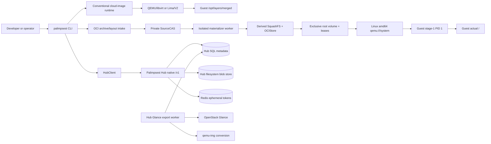

# Palimpsest Architecture

## Overview

Palimpsest Local은 검증된 cloud image, SquashFS layer, OCI-layout bundle을 로컬에서 보관하고, 선언형 VM 프로젝트와 OCI-root 실행을 제공하는 독립 Python CLI다. 로컬 패키지(`palimpsest-local`)의 repository는 [openstack-afterglow/palimpsest](https://github.com/openstack-afterglow/palimpsest)이며 이 문서는 `codex/oci-root-phase1` 작업트리를 기준으로 작성했다. 일반 패키지 버전은 `palimpsest-local 0.1.0.dev0`(`pyproject.toml`), 별도 Hub 패키지는 `palimpsest-hub 0.1.0`(`hub/pyproject.toml`)이다.

1분 요약:

- `src/palimpsest_local/cli.py:main`이 artifact, registry, build, VM, compose 명령을 분기한다.
- conventional cloud-image runtime은 immutable `qcow2`/`raw` base와 read-only SquashFS layers를 QEMU/libvirt 또는 Lima에 붙이고, guest의 `/opt/layers/merged`에 OverlayFS를 만든다.
- OCI-root runtime은 로컬 OCI archive/layout을 snapshot하고 private source CAS, 격리된 SquashFS 변환, exclusive root volume을 거쳐 Linux amd64 KVM guest의 실제 `/`로 전환한다.
- `hub/`는 별도 배포 단위인 native `/v1` artifact API와 Glance export worker다. Hub는 Docker/OCI `/v2` registry가 아니다.

## Development status

개발 세션 재개는 [개발 인계 문서](docs/development-handoff.md)에서 시작한다.
이 문서는 전체 목표·최근 검증·작업트리의 미게시 변경·승인 대기와 다음 순서를
모으는 탐색 문서이며, 아래 source 계약이나 실행 증거를 대체하지 않는다.
[`README.md`](README.md)와 [`agent.md`](agent.md), [`AGENTS.md`](AGENTS.md)가
같은 인계로 연결된다. 2026-09-14 문서화 작업은 런타임 변경 또는 원격 게시·
GPU 점검 승인이 아니며 기존 staged PCI 구현과 미승인 증거 변경을 보존한다.

공개 OCI `run IMAGE [OPTIONS] -- COMMAND [ARG...]`는 원본 Entrypoint를 유지하고 Cmd만 교체한다. trusted SourceCAS의 descriptor-verified config를 다시 읽어 원본 process 전체와 대조하며, 새 boot-plan v4에 원본 벡터·명시 command·선택 user·실행 process를 결합한다. 기본 v2와 user-only v3, source/lower receipt와 guest ELF·권한 정책은 유지한다. 공식 TensorFlow 2.21 CPU와 PyTorch 2.8 CUDA runtime 원본 archive의 취득은 통과했으며, 각각의 실제 CPU 행렬 연산·root/PID1·정리 증거는 별도 [ML 검증](docs/oci-ml-compatibility.md)으로 구분한다. GPU passthrough/sharing은 미구현이며 [GPU 및 OpenStack 경계](docs/oci-gpu-support.md)에 조사와 제안만 기록한다.

`9239dbd`에서 ML native 두 사례를 각각 1회 실행했고 둘 다 CPU tensor·root identity·PID 1 단계에 도달하지 못했다. TensorFlow의 detached run은 116.6초에 이름과 exit 0을 반환했고 guest console에 root 전환·workload 시작·READY commit이 남았지만, 이어진 공개 `exec`이 5.09초에 `timeout-source=run-lock-timeout` 하나만 남기고 실패했다. 저장된 stdout은 비어 있고 `did not complete: timeout` 안내도 없어 만료한 경계는 30초 guest exec 기한이 아니라 host run lock 획득이다. `MonitorClient.exec_request`는 각 mailbox 교환의 전과 후에 그 lock을 잡으므로 guest 명령이 이미 admit됐는지는 확정되지 않고, lock 보유자도 어떤 receipt에도 남지 않는다. 별개로 ledger는 status `failed`와 일반 메시지 `OCI-root launch failed`, handoff `failed`(lifecycle receipt는 `ready`), monitor owner journal `control-lost` revision 7을 남겼다. 이는 durable READY 이후 detached worker가 제어를 잃었음을 보여 주지만 exec lock 대기와의 시간 순서는 기록되지 않아 인과는 미확정이다. PyTorch는 더 앞선 `public-run-command`에서 고정 coordinator 코드 `[parent-response:timeout]`으로 실패했고 ledger는 `defined`에 머물렀다. 관측된 두 경계는 모두 guest 실행 기한이 아니라 coordinator spawn handshake와 host run lock이다. 남은 진단 대상은 post-READY worker 실패 사유가 일반 메시지로 소실되는 점, run lock 보유자 식별, coordinator spawn 15초·launch authority 60초·run lock 5초 고정 한도의 대용량 materialization 적합성이다. 자원 보존은 확인했다. TensorFlow 실행 뒤 새 domain은 남지 않았고 PyTorch의 새 `ml-pytorch-69afe41a`는 inactive로 보존했으며 archive digest와 zero-active는 그대로다. GPU·CUDA·외부 network는 여전히 범위 밖이다. 상세는 [ML 검증](docs/oci-ml-compatibility.md)에 있다.

공개 `exec`은 이제 `--timeout SECONDS`(정수1–600, 기본30)로 한 명령의 guest 실행 기한만 정한다. protocol v2와 guest PID 1의 상한은600,000 ms이고 생략 시 기존30초 동작이 그대로다. OCI-root 전용이며 cloud-image run에 지정하면 adapter 호출 전에 거부한다. 재시도·run lock·monitor 대기·권한·정리·64KiB 출력 한도는 바꾸지 않으므로 이 변경만으로 `9239dbd`에서 관측된 coordinator spawn 또는 run lock 경계가 사라지지는 않는다. `init.c` 변경에 따라 봉인 stage-1 ELF를 고정 toolchain image로 두 번 재현 빌드해 `1fe7b61cdf856d85d7ab37681e386e303534658f1874846859c43d48788052bf`(103,360 bytes, mode0644)를 확인하고 source-bundle pin을 `b2788f5f9609b27157b382bd884442ff8c1b9cb8f7dba7a2b6f10dc708614bf0`으로 갱신했다. 변경 ELF의 native 부팅 matrix와 ML 재검증은 별도 증거다.

정확한 Linux checkout `06697bde83f4e0734955320577a59cc9c7e06f27`에서 timeout/CLI/guest-C/dispatch 선별605건(4 skip)과 monitor/ML/lane contract 186건이 통과했고, 변경된 packaged stage-1은 43-boot KVM matrix를 122.35초에 통과했다. 이어진 TensorFlow 실기는 공개 `exec --timeout 150`을 실제 사용했지만 126.39초 뒤 동일한 `framework-exec-command`/`timeout-source=run-lock-timeout` 경계에서 실패했다. 따라서 넓어진 guest 기한이 host run-lock 경계를 제거하지 않았다는 것만 확인하며 guest 명령 admit·실행·인과 순서는 여전히 미확정이다. 새 domain은 남지 않았다. PyTorch는 303.18초 뒤 `public-run-command`에서 `[parent-response:timeout]`으로 실패했고 새 `ml-pytorch-8be2db32`(UUID `bfed8772-c656-41ac-8514-164c3e7bb00b`)를 inactive·persistent·autostart disable로 보존했다. 최종 full inventory는 기존18개와 새1개 domain 모두 inactive, active0, 원본 archive16개 전체 digest 불변이다. 어느 retained domain도 stop·undefine·adopt하지 않았고 두 framework 모두 CPU tensor·root identity·PID1 검증에는 도달하지 못했다.

정확한 Linux checkout `2bb3a2dd70ad1b7e71765eb44a6bf43e4b0ed5cf`에서 timeout/CLI/guest-C/dispatch 선별 및 새 진단 검사 선별353건(187건 47.78초 + 166건 9.13초)이 통과했다. 이어진 TensorFlow 실기는 125.65초 뒤 `framework-exec-command`에서 실패했지만, 새로 구현된 진단이 `timeout-source=run-lock-timeout`과 함께 Linux kernel lock 보유자 `run-lock-holder-pid=1727406`을 성공적으로 포착했다. 해당 PID는 detached monitor child worker(`oci_monitor_ipc --private-child-v2`)였으며, run ledger는 durable READY 수신 후 worker failure인 `oci_root_launch_failure={"stage": "post-ready-worker", "source": "lifecycle-transport", "category": "timeout"}`를 기록했다. 관측된 lock 보유자 PID와 사후 failure receipt는 독립된 사실이며, transport timeout이 lock 대기에 선행했다거나 실패 처리 중에 lock을 잡았다는 인과 순서를 뜻하지 않는다. 소스상 exec은 run lock 아래에서 `before_stop_send`를 호출하고 그 직후 `_send_all` 또는 `_recv_frame`이 transport `TIMEOUT`을 일으킬 수 있어, lock 경합이 worker 실패에 앞섰거나 공통 원인을 공유할 가능성이 열려 있다. 두 사건의 인과 순서와 정확한 transport 만료 지점은 미확정이다. 새 domain은 남지 않았다. PyTorch 실기는 297.04초 뒤 `public-run-command`에서 coordinator timeout(`[parent-response:timeout]`)으로 실패했고 새 `ml-pytorch-484e1dda`(UUID `74cc9561-61cc-45d1-a070-a4262b6c73a9`)를 inactive·persistent·autostart disable로 보존했다. 최종 full inventory는 기존19개와 새1개 domain 모두 inactive, active 0, 원본 archive 16개 전체 digest 불변이다. 어느 retained domain도 stop·undefine·adopt하지 않는다.

PyTorch CPU-only proof가 guest에 진입하기 전에 세 차례 `public-run-command`의 `[parent-response:timeout]`에서 멈춘 관측에 따라, 현재 source는 OCI monitor child의 bounded spawn handshake를 15초에서 허용 상한30초로, 이를 감싸는 parent coordinator response 대기를30초에서60초로 늘린다. 두 기한은 [`oci_run_adapter.py`](src/palimpsest_local/oci_run_adapter.py)의 모든 OCI-root launch에 고정 적용되고, coordinator의 hard maximum120초·불확실 결과 보존·no-kill·endpoint/journal 재인증·guest READY75초·guest exec 기한은 바꾸지 않는다. 이 변경은 GPU attach가 아니며, proof의 성공 조건은 여전히 hostdev/NIC/filesystem 없이 `torch`가 exact 2×2 결과 `[19,22,43,50]`, sum134, device `cpu`, `torch.cuda.is_available()==False`를 guest에서 출력하는 것이다. 관련 local coordinator/run-adapter/ML contract 선별119건은 통과했지만 native CPU 연산 성공은 별도 exact-SHA 실기로만 판정한다.

`32ac1c3` exact checkout의 Linux 선별119건은 통과했지만 첫 PyTorch 재실기는 326.87초 뒤 다시 `public-run-command`의 `[parent-response:timeout]`에서 실패했다. 새 `ml-pytorch-aeed93b0`(UUID `a1ed4f44-4dd5-48ac-b948-86425eb2e710`)은 inactive·persistent·autostart disable로 보존됐고, monitor journal은 `committed` revision3과 `active_binding=null`, worker PID1980445를 남겼다. 부모 만료 뒤 살아 있던 worker의 `/proc/1980445/io`는 `rchar=183498278198`을 기록했다. Source 추적 결과 `MonitorLaunchAuthority.validate()`의 각 monitor-lease guard가 3.7GB lower payload 전체를 다시 digest했으며, 단순 30/60초 확대만으로는 이 반복 검증을 수용할 수 없었다. 현재 source는 각 process의 authority reconstruction과 worker launch 직전에 full payload/ACL 검증을 수행하고 그 결과의 immutable stamp를 보존한다. 그 뒤 같은 authority의 checkpoint는 held FD와 visible path의 device·inode·owner·mode·link count·size·mtime·ctime 및 기존 receipt/ACL 경계를 stamp와 재검증하되 payload를 다시 읽지 않는다. 선행 full validation 없는 metadata-only 요청은 거부한다. 이는 GPU 경로를 추가하지 않으며, CPU tensor proof는 다음 exact-SHA native 실기 전까지 미통과다.

`021dd38` exact checkout의 Linux monitor/lower/run-adapter 선별248건은 통과했다. 이어진 PyTorch 실기는 이전 coordinator response 경계를 넘어섰지만 193.63초 뒤 `public-run-command`에서 `Domain not found` 진단과 `run-lock-holder-pid=2063885; timeout-source=run-lock-timeout`으로 실패했다. 보존 ledger는 이후 `ml-pytorch-ed03b448`(UUID `b02f65da-773e-4767-b9a8-63c373abc9a7`)의 `status=running`과 durable READY에 도달했고 domain은 running·persistent·autostart disable, interface/hostdev/host-filesystem 없음으로 관측됐다. 작업자가 stop·undefine·adopt하지 않았다. 원인은 coordinator 반환 직후 initial `MonitorClient` 생성만 일반5초 기한으로 run lock을 기다린 반면 worker가 activation 전 committed-domain resolution과 검증 중 같은 lock을 더 오래 보유할 수 있는 경계다. 현재 source는 이 최초 client 획득만60초로 제한한다. 이후 public exec/stop의 client 기한, IPC5초, READY75초, guest exec, retry·cleanup·kill 정책은 바꾸지 않으며 성공은 새 exact-SHA native proof로만 판정한다.

같은 보존 run이 durable READY에 도달한 뒤 exact state root에서 동일한 공개 `exec --timeout 150`을 실행했고 5.30초에 `ML_OK pytorch 2.8.0+cu126 [19, 22, 43, 50] 134 cpu False`를 반환했다. 이는 핀된 공식 image의 PyTorch import·정확한 행렬 연산·CPU device·CUDA unavailable을 guest 안에서 직접 확인한 증거다. 앞선 pytest 호출은 실패했으므로 root identity·PID1 거부·proof-owned stop/rm/cleanup까지 통과한 전체 qualification으로 승격하지 않는다.

Linux OCI layer의 경로 문법은 `/`만 계층 구분자로 사용하고 리터럴
backslash는 파일명 문자로 보존한다. `a\\b`를 `a/b`로 치환하거나 같은
entry로 합치지 않으며 hardlink·whiteout·normalized tar도 이 구분을
유지한다. NUL, absolute path, slash-delimited `..`, normalized root escape와
예약 `.palimpsest/` subtree 거부는 그대로다. 새 admission은
`palimpsest.oci-layer-intake.v2`로 derived recipe에 결합되어 v1 cache와
alias하지 않는다. pack/normalization contract와 guest 정책은 바꾸지 않는다.

GPU 후속 목표는 사용자가 선택한 **OpenStack GPU instance 자체의 OCI rootfs
부팅**이다. 중첩 L2나 로컬 host GPU 재할당을 선행 조건으로 삼지 않는다.
Nova가 장치 할당을 소유하고 Palimpsest는 self-contained boot disk·cloud 전용
bootstrap/control 신뢰 계약·kernel-matched guest driver를 별도로 제공해야 한다.
현재 local kernel/initrd·virtio serial/monitor binding은 일반 Nova 부팅에 자동
이식되지 않으며 Hub의 Glance-to-Hub export도 반대 방향이다. Cinder root는
instance별 exclusive attachment와 명시 delete/retain 정책을 목표로 하고,
보존된 detached root 재사용과 shared data volume을 구분한다. 이는
[선택된 구현 경로](docs/oci-gpu-support.md#selected-target-the-nova-instance-itself-owns-the-oci-root)의
계획이며 새 boot exporter·GPU·OpenStack 실기 성공 또는 cloud 변경 승인이 아니다.

로컬 KVM PCI 검증의 첫 구현은 독립적인 read-only sysfs 사전 점검기다.
PCI 주소 하나의 장치 ID·현재 드라이버·부팅 화면 표시·reset 파일 존재와
IOMMU 그룹 구성원을 관찰할 뿐, 할당 가능 판정이나 장치 소유권을 부여하지
않는다. OCI-root의 `hostdev` 거부·guest 장치 집합은 그대로이며
passthrough 연결·게스트 GPU 드라이버·CUDA 성공은 아직 미구현/미검증이다.
이번 원격 hardware 점검 helper는 내부 코드 전송 승인 단계에서 차단되어
실행하지 않았고, 새 서버 GPU 상태나 VFIO 할당 결과를 얻지 못했다.

`049a978`의 ML 실기는 두 framework 모두 VM 전에 중단됐다. TensorFlow는
격리 materializer의 layer ordinal4에서 `oci-invalid-path`로 실패했고, 후속
bounded 진단은 경로 원문 없이 원인이 리터럴 backslash임을 확인했다.
PyTorch는 큰 export 준비 중 libvirt keepalive 연결 만료로 defineXML 전에
실패했으며 partial run ledger를 보존했다. 두 결과 모두 CPU tensor·root/PID1
또는 cleanup 성공이 아니고, 기존 inactive domain15개·archive16개와
zero-active 상태 보존만 확인했다.

`3f8e79e`의 정확한 Linux checkout 선별 검사는763건이 다른 outcome 없이
통과했고, 테스트 전용 `132c6c5`의 새 synthetic pack/exact-name readback도1건
통과했다. 두 SHA의 GitHub 패키지가 성공했다. 같은 `132c6c5` TensorFlow 실기는
VM 생성까지 진행한 뒤 pytest rc1로 실패했다. 새 domain은 accounting error 없이
inactive로 보존됐고 journal, 기존15개와 새1개 domain, archive16개 및 zero-active
postflight를 확인했다. 정확한 실패 명령과 guest root 전환·CPU tensor·인증 root·
PID1 거부 도달 여부는 미확정이다. 제한된 원격 진단 조회는 거부 또는 중단되어
재시도하지 않았으며 별도 명시 승인을 기다린다. 따라서 이 항목은 해당 guest
검사의 성공 증거가 아니고 GPU 작업도 수행하지 않았다. 동일 SHA의 PyTorch 실기도
pytest rc1로 실패했고 wrapper의 inner attribution/snapshot과 outer attribution/
postflight가 모두 실패해 resource disposition을 확인하지 못했다. 별도 read-only
inventory는 새 persistent domain 하나가 shut off·autostart disable 상태임을
확인했지만 이는 owned attribution이나 전체 domain/archive 보존 성공이 아니다.
해당 domain은 owned로 채택하거나 재실행·제거·추가 조회하지 않았다. 두 native
실패 원인과 후속 수정은 제한된 진단의 별도 승인을 기다린다.

후속 사용자 승인으로 서버 원문을 반출하지 않고 분석한 결과, `132c6c5`
TensorFlow는 root-volume entry 수 assertion에서 중단됐음을 확인했다.
테스트가 디렉터리 한 개를 기대했지만 실제 `oci_root_volume._paths` 계약은
동일 volume ID의 `.raw`·`.json` 두 regular file이다. 후속 테스트는 preparation
transaction의 volume ID에 묶인 두 파일과 정확한 생성/제거 집합을 검사한다.
이는 테스트 계약 수정이며 CPU tensor·인증 root/PID1 검사 통과 또는 production
저장 구조 변경이 아니다. 과거 실패는 유지하고 수정 후 실기를 별도로 기록한다.

`a6a1d84`의 후속 TensorFlow 실기는 고정 phase receipt 기준
`framework-exec-command`에서 rc1로 실패했다. 공개 detached run·provenance·
root volume·초기 인증 root·CPU-only domain 검사는 앞서 완료했지만 CPU 연산,
독립 앱 root 비교·PID1 거부·정상 stop/rm 성공은 아니다. 사후17개 baseline
domain·16개 archive·zero-active 보존은 통과했고 추가 domain은 남지 않았으나
wrapper attribution은 RuntimeError로 실패했다. 따라서 부팅 전 실패나
정리 성공을 추론하지 않는다. `5b94a728`의 coordinator 관련 선별 검사는
로컬228건과 Linux 전용6skip 뒤 정확한 Linux checkout에서234건 모두 통과했고
GitHub 패키지도 성공했다. 새 ML 또는 GPU 실기 성공과 구분한다.

같은 TensorFlow 실패의 후속 제한 진단은 고정 monitor-client timeout
표시만 확인했다. 자체 deadline·IPC timeout·run-lock timeout이 동일 오류로
합쳐지므로 어느 대기에서 만료됐는지, Python이 실행됐는지는 미확정이다.
나머지15개 고정 오류 표시 부재를 guest 성공으로 해석하지 않으며,
실행 경로·시간 제한·guest 정책 변경이나 새 VM 재시험은 하지 않았다.

`de304ea`의 익명 registry intake는 같은 Linux checkout 선별76건과 공개 `oci pull`을 통한 GHCR 비특권 NGINX·Quay Prometheus BusyBox 취득/OCI CAS 검증을 통과했다. 새 archive의 부팅 성공은 아니다. 직전 동일 guest/runtime `cfb8015`의 별도 VM 재검증은 Redis user override와 비특권 NGINX가 통과했고 기본 PostgreSQL·Redis·NGINX는 권한 거부와 함께 실패했다. 실패는 inactive로 보존하고 성공 자원은 정상 제거했으며 guest 권한 정책은 바꾸지 않았다. 새 [registry 검증 기록](docs/registry-intake.md#verified-checkpoint)은 취득 성공과 VM 호환성 결과를 분리한다.

`93c1eb0`의 self-FD 변경은 같은 서버 SHA 선별481건·packaged-binary34건과 stage1 43boots/44QEMU(121.28초), UID0/101 stdio V3(16.16/16.11초), 기존 v2 빌드 이미지 cold 공개 lifecycle(22.56초)을 통과했다. MySQL 일회용 진단은 최종 초기화·서버 준비, 실제 `/`와 인증 root 일치, PID1 거부까지 통과했지만 passwordless ping의 exit0/인증 거부에 alive 문자열을 추가 요구한 테스트가 실패했다(116.21초). 새 VM/root는 폐기했고 기존12개 domain/archive와 zero-active를 보존했다. 후속은 일회용 테스트의 도달성 판정만 공식 ping exit-status 계약에 맞추며 인증 SQL 성공이나 기본 이미지 성공으로 확대하지 않는다. [상세 결과와 중간 실패](docs/oci-linux-process.md#self-fd-verification-checkpoint--93c1eb0)를 구분한다.

사용자 승인 self-FD 호환성은 workload 자식 전용 `/dev/fd → /proc/self/fd` 한 별칭을 추가한다. 정확한 `/dev` 집합은 여섯 장치와 `stdout`·`stderr`·`fd`의 아홉 항목이며 `stdin`은 없다. PID1 FD 마스킹·자식 FD 폐쇄·capability/credential/seccomp 정책은 변경하지 않는다. 재현 stage1 ELF와 독립 proof fixture를 함께 갱신하며, 변경된 게스트의 native matrix·UID0/101 main/exec·일회용 MySQL 최종 준비 검증은 각각 별도 증거로 기록한다. 아래 `/dev/fd/63` 실패는 변경 전 결과다.

`89fad3c`의 일회용 MySQL 난수 비밀번호 실기는 공개 `run -d --user mysql` 반환과 DB 파일 초기화·임시 서버 시작까지 진행했다. 이후 이미지 entrypoint의 process substitution이 사용하는 `/dev/fd/63` defaults 파일 열기 실패로103.24초에 실패했다. 최종 초기화/서버 준비·service/root/PID1 독립 probe는 통과하지 않았다. 같은 서버 SHA 선별152건(7.23초)과 GitHub 패키지는 통과했고, 새 VM/run/root disk 폐기 및 기존12개 domain/archive·zero-active 보존을 확인했다. 검사한 출력의 비밀번호 패턴은 미검출이며 물리적 secure erase 보장은 아니다. Production/ELF 변경 없이 [결과와 다음 self-FD 호환성 경계](docs/docker-hub-service-matrix.md)를 기록한다.

`2626229`의 난수 비밀번호 진단은 같은 서버 SHA 선별173건(66.06초)을 통과했지만 실기1건은 host preflight에서4.04초에 실패했다. 테스트의 lifecycle 경로104B가 임시 suffix를 고려한97B 제한을 초과했으며 VM 부팅·난수 생성 전이다. 기존12개 domain/archive와 zero-active 상태는 보존됐다. 후속은 이 테스트의 VM 이름만 줄여90B로 만들며 production 경로 제한·guest·권한은 그대로다. [실패 증거](docs/docker-hub-service-matrix.md)를 서비스 또는 비밀번호 폐기 성공과 구분한다.

사용자 승인 후속 MySQL 난수 비밀번호 진단은 제품의 secret 입력 기능이 아니라 별도 테스트다. 원본 archive/layer는 보존하고 테스트용 파생 config의 고정 wrapper가 게스트 안에서만 난수를 생성한다. 값 자체는 host argv/environment나 OCI config에 넣지 않는다. 기존 default·`--user mysql` 실패와 별개로 초기화 완료 후 최종 서버 준비를 검사하며, socket ping은 인증 SQL 검증으로 확대하지 않는다. 비밀번호가 남을 수 있는 이번 테스트의 workload와 root disk는 성공·실패 모두 정확한 소유권을 확인한 공개 stop/rm으로 폐기한다. 정리 실패는 폐기 성공이 아니며 기존 실패 VM을 삭제하지 않는다. Production CLI·guest ELF·PID1·capability 정책은 변경하지 않는다. 구현·실행 증거는 [service matrix](docs/docker-hub-service-matrix.md)에 구분한다.

`aef88ef`의 별도 `--user mysql` 진단은 setgid 오류 없이 초기화 비밀번호 옵션 누락까지 진행했으나61.44초에 실패했다. 실제 `/` 전환·workload 시작은 확인했지만 detached run 반환·서비스 준비/socket과 독립 앱 root/PID1 검사는 통과하지 않았다. 같은 SHA 선별124건과 GitHub 패키지 발행은 통과했다. 기존11개+새 실패1개 domain·archive12개를 보존하고 활성 VM/QEMU 없음까지 확인했다. 다음 경계는 secret-safe 초기화 설정 전달이며 환경변수/secret 입력 계약과 사용자 결정 없이 비밀번호·빈 비밀번호 모드·권한 완화를 추가하지 않는다. [MySQL 결과](docs/docker-hub-service-matrix.md)를 참고한다.

`b7b8162`에서 `/dev` 독립 진단2boots(13.62초)와 배포 stage1 43boots/44QEMU(122.61초)가 통과했다. 원본 MySQL은 실제 `/` 전환·workload 시작을 지나 entrypoint의 `mysqld --verbose --help` 중 `setgid` 권한 거부로 종료했다(61.04초). 서비스 준비/socket 성공은 아니며 PID1·capability 정책을 유지한다. 기존10개와 새 실패1개 domain을 inactive로, archive12개를 원본 그대로 보존했고 활성 VM/QEMU는 없다. 다음 진단은 지원 중인 `--user mysql`의 별도 사례이며 원본 결과와 분리한다. [상세 증거](docs/docker-hub-service-matrix.md)를 참고한다.

`67cb80c`의 정확한 서버 checkout에서 선별475건(71.35초)이 통과했고 GitHub SHA별 패키지도 발행됐다. 별도 `/dev` 진단은 지원하지 않는 테스트 fixture mode0400 때문에 QEMU 시작 전에 실패했다. 기존10개 inactive domain·12개 archive·활성 VM/QEMU 없음 보존 검사는 통과했다. 중복 fixture 제거와 portable 생성 회귀를 추가하며, 아직 새 stage1/MySQL 실기 성공으로 기록하지 않는다. [실패와 후속 증거](docs/docker-hub-service-matrix.md)를 구분한다.

사용자 승인 후속은 `/dev` transition target에만 populated 입력을 허용하고, 원본 항목은 읽거나 복사하지 않은 채 검증된 devtmpfs로 덮는다. root0:0·정확한0755·nofollow·OverlayFS 및 mount 직전 identity 검사를 유지한다. `/proc`·`/sys`·generic의 빈 디렉터리 조건과 workload 전용6개 장치/2개 alias·PID1 보호는 그대로다. 별도 real-mount 진단과 새 ELF 부팅/MySQL 결과는 구현과 분리한다.

`71704b2`의 `/sys`0555 변경은 같은 서버 SHA 선별393건과 새 ELF의43 boots/44QEMU(122.74초)를 통과했다. 원본 MySQL은 다음 `dev; nonempty` 검사에서 실패(119.94초)해 root 전환·앱·socket 성공은 아니다. 원본 base layer에 `/dev` 장치/FIFO10개가 있으며 빈 디렉터리 정책은 유지했다. 기존10개 inactive domain·12개 archive·활성 VM/QEMU 없음 보존 검사는 통과했고 새 실패 runtime은 보존, 해당 domain은 없다. GitHub 패키지 workflow는 jobs 없이 startup_failure여서 패키지 공개 성공을 주장하지 않는다. [상세 증거와 다음 계약](docs/docker-hub-service-matrix.md)을 참고한다.

2026-09-13 사용자 승인에 따라 root 전환의 `/sys` 입력도 root 소유·빈 디렉터리의 정확한0555 또는0755를 허용한다. `/dev`·generic 정책, nofollow·전체 mode bits·mount 직전 초기/현재 FD identity 비교와 PID1/workload 보호는 유지하며 chmod나 원본 변경은 없다. 변경 전 서버13bd2e9의 C 선택3건으로 sys0555 거부를 재현했다. 새 배포 ELF와 MySQL 실기 검증은 이 진단과 분리하며 [service matrix](docs/docker-hub-service-matrix.md)에 기록한다.

`2cb6a3e`의 공식 Redis `--user redis` 실기1건이 새 테스트 계약으로 통과했다(27.96초). 공개 detached run, readiness/version, UUID-bound NIC 없는 XML, proc/sysfs 장치 대조, PONG, 실제 `/`와 인증 root 일치, PID1 거부, stop/rm을 확인했다. 동일 서버 SHA 선별139건(7.34초)도 통과했으며 기존10개 inactive domain·12개 archive를 보존하고 활성 VM/QEMU 없음까지 확인했다. 기본 Redis·Postgres·MySQL·NGINX 및 전체 Gate2의 새 성공은 아니며 production/ELF는 그대로다. [실기 증거](docs/docker-hub-service-matrix.md)를 참고한다.

후속 Redis-user 테스트 계약은 proc/sysfs 인터페이스 집합·유일한 양수 index를 대조하고 `lo`(type772, flags0x9/0x49) 외에는 선택적 `tunl0`(type768)·`ip6tnl0`(type769)의 정확한 flags0x80만 허용한다. 실행 중 domain XML의 NIC 부재도 별도로 검사한다. 알 수 없는 장치·UP 터널·불일치·중복/누락은 거부하며 UID/GID·capability·NNP/seccomp·PING·root/PID1·정상 정리 검사는 유지한다. 이는 literal only-lo에서 명시적으로 바꾼 테스트 계약이며 production/ELF 변경이나 이전 실패의 소급 통과가 아니다. 새 native 결과는 별도로 기록한다.

`bb879dd`의 Redis `--user redis` 재진단에서 실제 `PONG`(exit0), 앱 `/`와 전후 인증 root identity의 일치(device21/inode2), PID1 직접 접근 거부를 확인했다. 추가 장치는 `tunl0`(type768)·`ip6tnl0`(type769)이고 둘 다 flags0x80으로 UP 비트가 없다. 엄격한 only-lo 검사는 그대로 실패했다(23.62초). 서비스 응답 성공과 전체 qualification 실패를 구분한다. 기존9개 inactive domain·12개 archive 및 새 실패 domain 보존 검사는 통과했고 활성 VM/QEMU는 없다. Production/ELF나 검사 허용 기준은 변경하지 않았다. 다음 검토는 비활성 커널 터널과 외부 NIC를 구별하는 검증 계약이며, 상세 증거는 [service matrix](docs/docker-hub-service-matrix.md)에 있다.

`f86e4da`의 같은 서버 SHA에서 선별453건, 새 배포 ELF의 stage-1 43 boots/44 QEMU(122.02초), UID0/101 stdio2건(31.00초)이 통과했다. Redis 사용자 지정은 lo의127.0.0.1/8·UID999/GID1000·capability0·NNP/seccomp를 확인했으나 추가 인터페이스2개를 감지한 테스트가 PING 전에 실패했다. NIC 없는 domain XML과 커널 내장 터널 설정을 확인했지만 장치 이름/상태는 다음 진단 대상이다. 새 실패 domain은 shut off로 보존했고 기존8개만 기대한 최종 inventory gate는 실패했다. 상세 범위는 [service matrix](docs/docker-hub-service-matrix.md)에 기록하며 Redis 서비스 통과를 주장하지 않는다.

후속 guest loopback 구현은 workload 자식의 mount 격리 후, credential/capability 제거 전에 고정 `lo`만 검증하고 올린다. 메인과 추가 exec는 같은 VM 내부 network namespace를 공유하며 매 실행 준비에서 idempotent 검사를 수행한다. `network=none`은 외부 NIC·host port·DNS·default route를 추가하지 않는 경계로 유지한다. 이 source 변경의 packaged ELF 재현 빌드와 native Redis PING 결과는 별도 증거이며, 아래 `1752ba9` 실패를 소급 수정하지 않는다. `/sys` 모드·환경변수 override·DB 초기화 정책은 이번 변경에 포함하지 않는다.

`1752ba9`의 공식 서비스 실기는 기본 Postgres·Redis·MySQL·NGINX 네 건과 별도 Redis `--user redis` 한 건 모두 실패했다. Postgres/NGINX는 소유권·사용자 전환 관련 권한 거부, 기본 Redis는 setpriv capability 유지 거부, MySQL은 root 전환의 sys mode 검사 거부로 서비스 probe에 도달하지 않았다. Redis 사용자 지정만 readiness·version·실제 /의 device 21·inode 2 및 PID1 접근 거부까지 확인했지만 PING은 Network unreachable이었다. 로컬·동일 서버 SHA 선별109건과 마지막41개 보존 검사는 통과했으며 활성 VM/QEMU는 없다. 새 실패 등록 네 개와 runtime·원본을 보존했다. Production guest·권한·네트워크 정책은 변경하지 않았고 다음 단계는 내부 loopback 및 이미지 초기화 요구의 분리 검토다. 상세 증거와 미검증 경계는 [service matrix](docs/docker-hub-service-matrix.md)에 기록한다.

공식 Docker Hub 서비스 네 종류의 새 검증은 [service matrix](docs/docker-hub-service-matrix.md)로 분리한다. Postgres 17·Redis 7 Alpine·MySQL 8.4·NGINX stable Alpine의 원본 기본 실행과 별도 Redis user override를 각각 검사한다. 서비스 readiness와 실제 SQL/PING/HTTP 응답을 구분하며, 기존 비특권 NGINX나 Gate 2 성공을 이 matrix의 성공으로 간주하지 않는다. 이 추가는 테스트 경계이며 OCI env/argv override, guest loopback 설정, 권한 또는 production guest 변경이 아니다.

현재 local build-to-run checkpoint는 exact `d72796c`다. 같은 qualified
Linux/KVM host에서 기존 `g35` Linux amd64 OCI archive의 pinned manifest를
안전한 local layout으로 읽고, fresh network-none Buildx builder를 사용한
Gate 1 두 건(2.47초)과 새 v2 artifact 생성, fresh runtime의 Gate 2 한 건
(18.90초)이 통과했다. 새 archive SHA-256은
`e7782db13bfd97bbf9cb2788007e51ffc7b2c4f7f61aed504b8b0f3b98492117`,
manifest는 `sha256:7844e9d0355d74cd435ede5a96681f7c87545ff15a17d6c02143e14ca38a87db`다.
Gate 2는 detached run, running domain, 전후 root proof, image-baked marker와
실제 root identity 일치, PID 1 root 접근 거부, stop/rm, source 보존과 Docker
CLI 미사용을 확인했다. 24개 pre/post-build/post 보존 검사는 기존 inactive
domain 네 개와 archive 일곱 개, zero-active 상태를 유지했고 owned builder는
제거됐으며 private command journal도 통과했다. 이는 같은 host의 기존 base를
사용한 새 Palimpsest image proof이며 fresh third-party download, Docker Hub
direct run, HTTP, cross-host transfer 또는 일반 application 호환성 증명이 아니다.
Production source·guest ELF·PID 1·권한 정책은 바뀌지 않았다. 첫 wrapper는
Buildx 출력 열 간격 가정 때문에 Gate 1 전에 실패했고 그 evidence를 보존했다.
상세 범위와 evidence는 [build-to-run acceptance](docs/oci-root-build-run-acceptance.md)에 있다.

현재 별칭 실기 checkpoint는 `c563867`이다. workload 전용 `/dev`에 `stdout → /proc/self/fd/1`, `stderr → /proc/self/fd/2`만 추가하고 기존 여섯 character device와 부모 전용 console, PID 1 보호·capability·NNP/seccomp 정책을 유지했다. 같은 서버 SHA에서 core/qualification1,357건과 guest/ELF623건을 별도 통과했고, 재현 빌드된 게스트로43 boots/44 QEMU(121.81초), UID0/101 stdio2건(31.26초), 원본 NGINX1건(31.65초), 기존 빌드 이미지 cold lifecycle1건(22.08초)을 순차 통과했다. 각 실행 전후24개 보존 검사에서 기존 inactive VM네 개와 archive일곱 개를 보존하고 활성 VM/QEMU 없음을 확인했다. NGINX는 원본 argv/user의 `run -d`, worker 시작, 공개 exec, 실제 root 비교, PID1 거부, stop/rm을 통과했으며 HTTP·네트워크·직접 registry run·새 build·전체 Gate2는 검증하지 않았다. 상세 source/ELF pin, 실패 기록과 journal 증거는 [현재 process checkpoint](docs/oci-linux-process.md#bounded-stdio-alias-verification-checkpoint-c563867-2026-09-11)에 있다. 아래 과거 별칭 부재와 NGINX 실패는 소급해 성공으로 바꾸지 않는다.

2026-09-11 `7c7ac54`의 같은 Docker Hub `hello-world` archive는 기존 공개 foreground 실기 항목에서 1건 통과했다(13.68초). Linux KVM·512MiB·1vCPU·network none에서 원본 `/hello`의 출력·exit0와 새 run/domain 제거를 확인했다. 기존 inactive domain 네 개의 UUID/state/autostart와 archive 여섯 개의 hash를 전후 보존했다. 최초 preflight는 빈 `virsh` 출력의 줄바꿈 처리에서 VM 실행 전에 중단됐으며, 빈 줄 정규화만 수정한 후 본 검사를 실행했다. 이 항목은 독립적인 guest root/PID1 거부 검사·detached/exec·전체 Gate 2가 아니다. [실기 checkpoint](docs/docker-hub-intake-analysis.md)와 [GitHub 패키지 설치 검증](docs/install.md)을 구분한다. Production source·게스트 ELF·보안 정책 변경은 없다.

2026-09-10 `3aafb7a`의 새 Docker Hub `hello-world` 취득은 외부 Skopeo의 digest-preserving OCI archive 생성, 선택된 Linux amd64 manifest pin의 secure CAS snapshot, 실제 hard-worker cold SquashFS 변환까지 통과했다. remote index와 local manifest pin을 혼동한 거부 및 첫 root-owned archive의 chmod 실패는 보존했다. 기존 inactive domain 네 개는 변경하지 않았으며 새 archive의 VM 부팅·Gate 2는 실행하지 않았다. 상세 digest와 재현 경계는 [현재 intake 분석](docs/docker-hub-intake-analysis.md)에 기록하며 direct registry `run` 구현으로 확대하지 않는다.

메인 출력 통합의 현재 실기 checkpoint는 `9736132`다. `d32328a`의 동일 guest에 로컬·서버 선별686건이 통과했고, proof 동기화 후속은 로컬·정확한 서버 SHA의423건이 통과했다(중복 합산하지 않음). 같은 `9736132`의43 boots/44 QEMU와 영수증 검증, UID0/101 stdio2건, 기존 빌드 이미지 cold 공개 lifecycle1건이 통과했다. 메인·추가 exec의 workload-owned0600 FIFO 재열기, 인증된 실제 root와 PID1 거부를 확인했다. 각 실행의21개 사전·사후 보존 검사와 stdio/cold의 전용 journal 각28기록도 통과했다. 중간 STOP/receipt 순서 실패는 [process evidence](docs/oci-linux-process.md)에 보존하며 표준 별칭·원본NGINX·새 application build·전체Gate2 또는 운영 계정 설치 완료로 확대하지 않는다.

구현 상태와 검증 수준은 분리한다. 2026-09-08 아키텍처 정리 시 portable lane manifest 검사와 합쳐진 작업트리의 `core-cli` 1025건, architecture guard focused 13건이 통과했다. 이후 `c95d948`의 서버 관련 검사 567건·real packer 3건과 기존 빌드 이미지의 cold public exec 1건이 통과했다. 같은 SHA의 원본 Redis는 변환 뒤 stage-1 filesystem 검증에서 실패했다. 아래 현재 checkpoint와 역사적 qualification을 구분하며 전체 suite·Gate 2 재통과를 뜻하지 않는다.

| 기능 | Implementation | Verification evidence | Current limit | Source |
| --- | --- | --- | --- | --- |
| 로컬 artifact store와 XDG state | implemented | source-reviewed, test-defined | 같은 UID가 state를 악의적으로 다시 쓰는 OS sandbox는 아님 | [`state.py`](src/palimpsest_local/state.py), [`artifact_store.py`](src/palimpsest_local/artifact_store.py), [`tests/unit/test_state.py`](tests/unit/test_state.py) |
| conventional cloud-image VM | implemented | source-reviewed, test-defined | backend별 host 도구가 필요하고 root pivot은 하지 않음 | [`cloud_runtime.py`](src/palimpsest_local/cloud_runtime.py), [`lima.py`](src/palimpsest_local/lima.py), [`tests/unit/test_cloud_runtime.py`](tests/unit/test_cloud_runtime.py) |
| `palimpsest.yml` multi-VM reconcile | implemented | source-reviewed, test-defined | strict subset; Linux KVM port publishing과 shared writer는 거부 | [`project_runtime.py`](src/palimpsest_local/project_runtime.py), [`project.py`](src/palimpsest_local/project.py), [`tests/unit/test_project_runtime.py`](tests/unit/test_project_runtime.py) |
| OCI local archive/layout intake | implemented | source-reviewed, test-defined | source는 로컬 archive/layout만 받으며 registry reference를 직접 받지 않음 | [`oci_source.py`](src/palimpsest_local/oci_source.py), [`tests/unit/test_oci_source.py`](tests/unit/test_oci_source.py) |
| OCI layer materialization | implemented | source-reviewed, test-defined | Linux amd64와 qualified `mksquashfs` 경계; `/`만 separator이고 literal backslash는 보존; v2 intake recipe가 v1 cache와 분리되며 warm hit도 source authority를 우회하지 않음 | [`oci_converter.py`](src/palimpsest_local/oci_converter.py), [`oci_materializer.py`](src/palimpsest_local/oci_materializer.py), [`oci_materializer_worker.py`](src/palimpsest_local/oci_materializer_worker.py), [`tests/unit/test_oci_converter_first_pass.py`](tests/unit/test_oci_converter_first_pass.py) |
| OCI-root public KVM lifecycle | partial | source-reviewed, test-defined | `qemu:///system`, Linux x86_64, explicit host proof와 no-network만 지원; recovery/other architectures는 별도 gate | [`oci_run_adapter.py`](src/palimpsest_local/oci_run_adapter.py), [`OCIStartupEventService`·`close_oci_root_libvirt`](src/palimpsest_local/oci_root_runtime.py), [`MonitorLaunchAuthority.run`](src/palimpsest_local/oci_monitor_launch.py), [`tests/unit/test_oci_run_adapter.py`](tests/unit/test_oci_run_adapter.py), [`tests/kvm/test_oci_public_cli_live.py`](tests/kvm/test_oci_public_cli_live.py) |
| OCI-root explicit run user | implemented | source-reviewed; focused/native 결과는 별도 기록 | `--user USER[:GROUP]`만 허용하며 capability 추가·argv/env/cwd override·자동 소유권 변경은 없음 | [`oci_run_request.py`](src/palimpsest_local/oci_run_request.py), [`oci_boot_plan.py`](src/palimpsest_local/oci_boot_plan.py), [user contract](docs/oci-run-user.md) |
| guest stage-1 root transition와 PID 1 | implemented | source-reviewed, test-defined | production host lifecycle와 hostile-root availability 보장은 아님 | [`guest/stage1/init.c`](guest/stage1/init.c), [`guest/stage1/README.md`](guest/stage1/README.md), [`tests/kvm/test_oci_guest_stage1_live.py`](tests/kvm/test_oci_guest_stage1_live.py) |
| native Hub `/v1` upload/download/bundle | implemented | source-reviewed, test-defined | native `/v2` registry protocol은 없음 | [`hub/src/palimpsest_hub/api/hub.py`](hub/src/palimpsest_hub/api/hub.py), [`hub/tests/test_hub_api.py`](hub/tests/test_hub_api.py) |
| Hub Glance export worker | partial | source-reviewed, test-defined | OpenStack/DB/Redis와 qemu-img 전제가 있는 비동기 worker; worker 자체의 live 실행은 별도 운영 검증 | [`hub/src/palimpsest_hub/services/image_exports.py`](hub/src/palimpsest_hub/services/image_exports.py), [`hub/src/palimpsest_hub/worker.py`](hub/src/palimpsest_hub/worker.py), [`hub/tests/test_image_exports.py`](hub/tests/test_image_exports.py) |
| anonymous registry → local OCI archive | implemented | source-reviewed, live-verified | `oci pull`은 GHCR·Quay 익명 HTTPS Linux amd64 취득과 source CAS 검증을 통과함. 인증 및 직접 registry `run`은 미지원이며 취득은 부팅 증거가 아님 | [`registry_intake.py`](src/palimpsest_local/registry_intake.py), [`registry-intake.md`](docs/registry-intake.md) |

`162cebe` 진단 checkpoint: exact-SHA 서버 집중 검사 198건과 전용 게스트 native 43 boots / 44 QEMU proof가 통과했다. 당시 원본 Redis 실기는 실패했고, 고정 로그가 root-owned `/proc`0555와 exact0755 검사 충돌을 확인했다. entrypoint는 실행되지 않았다. 후속 사용자 승인에 따라 `/proc`에만 0555를 추가 허용하는 구현을 반영하며, 해당 수정의 native 결과는 별도로 검증한다. PID 1 보호는 유지한다. 이전 기존 빌드 이미지의 cold public exec 성공을 새 게스트 검증·전체 Gate 2·일반 이미지 호환성 완료로 확대하지 않는다. 자세한 결과는 [compatibility checkpoint](docs/oci-docker-hub-compatibility.md)에 기록한다.

후속 `d9b3593`의 로컬·exact-SHA 서버 집중 검사 각209건과 전용 native43 boots /44QEMU proof가 통과했다. 원본 Redis는 공개 `run -d`와 실제 `/` 전환·workload 시작까지 진행했으나 entrypoint의 `setpriv` capability 유지 요청이 거부돼 status1로 종료했다. 서비스 readiness 및 이후 service exec/root/PID1 비교 검사는 미통과다. 실패 domain 이름이 남아 기존 cold exec의 empty-domain preflight를 중단했지만, 추가 조회에서 guest는 이미 `shut off`이고 inactive 등록만 남았음을 확인했다. 독립 승인된 대체 계획으로 해당 등록의 UUID·shut-off·autostart 비활성·활성 VM 없음·원본 해시를 전후 확인했고, 동일 SHA의 별도 기존 빌드 이미지 cold 공개 run/exec/root/PID1 refusal/stop/rm이 통과했다(21.07초). 실패 Redis의 등록·자료는 보존했고 수동 stop/삭제나 PID1/workload 권한 추가는 하지 않았다.

`IMPLEMENTATION_PLAN.md`, [`docs/oci-public-runtime-roadmap.md`](docs/oci-public-runtime-roadmap.md), [`docs/oci-docker-hub-compatibility.md`](docs/oci-docker-hub-compatibility.md), 그리고 [`tracking/afterglow-palimpsest.json`](tracking/afterglow-palimpsest.json)은 각각 역사적 계획/qualification 기록 또는 Afterglow baseline 계약이다. 이 문서는 해당 파일의 완료 주장이나 hash를 재작성하지 않으며, 현재 소스와 테스트 정의가 우선한다.

## System context

`bb04a5b` 추가 exec 출력 소유권 checkpoint: 로컬·동일 SHA 서버 집중 검사 각297건과 게스트 바이너리 검사 각34건이 통과했다. 서버 체크아웃의 umask002로 ELF가0664가 된 초기 실패는 별도 재현 뒤 정확한 파일만0644로 복구했고, 내용·검사 기준은 유지했다. 이후 게스트43 boots/44 QEMU proof, UID0/101 stdio2건, 기존 빌드 이미지 cold public lifecycle1건이 통과했다. UID101 추가 exec의 FIFO는101:101·0600으로 재열기가 성공하고 main console은 기존root0:0·0600으로 재열기를 거부한다. PID1 보호·실제 root 비교·기존 실패 VM3개와 archive4개 보존을 확인했다. main 출력 전송·별칭·원본 NGINX·새 application build·전체Gate2 완료로 확대하지 않는다. [실기 결과](docs/oci-linux-process.md)를 참고한다.

`cc1fca7` 표준 I/O 실기 진단: 로컬·정확한 서버 SHA 집중 검사 각113건과 UID0/101 전용 native 2건(30.54초)이 통과했다. 실제 main console과 추가 exec pipe는 root-owned0600이며, 상속 FD 쓰기는 모두 성공하지만 UID101의 self-FD pathname 재열기는 EACCES였다. 표준 스트림 별칭은 없고 PID1 보호·capability0·NNP/seccomp·인증된 실제 root 비교는 유지됐다. 기존 실패 VM3개와 archive4개 해시 보존 및 새 진단 VM의 정상 정리를 확인했다. 앞선 테스트 C 컴파일 실패도 보존한다. 이 진단은 guest 구현 변경·원본 NGINX 성공·새 application build·전체 Gate2가 아니다. [실측 결과와 다음 경계](docs/oci-linux-process.md)를 참고한다.

`866d5e6` Linux ArgsEscaped checkpoint: 로컬 집중661건 통과·Linux 전용1skip, 정확한 서버 SHA에서662건 모두 통과했다. 원본 NGINX는 intake와 root 전환·entrypoint 실행을 지났으나 error.log 열기 권한 오류로 종료해 실기는 실패했다(20.71초). 보존 lower의 로그 symlink는 `/dev/stderr`·`/dev/stdout`을 가리키고 현재 게스트의 전용 `/dev`에는 해당 경로가 없어 후속 계약 검토 대상이다. 이는 소스 기반 설명이며 symlink 추가의 해결 효과는 미검증이다. 새 NGINX와 기존 Redis의 inactive 등록·자료 및 원본 해시는 보존한다. [상세 결과와 미완료 경계](docs/oci-linux-process.md)를 참고하며 NGINX readiness·public root/PID1 비교·전체 Gate2 성공으로 확대하지 않는다.

같은 SHA의 별도 기존 빌드 이미지 cold 회귀도 host ancestor 재검증 오류로 실패했다(5.51초). 어느 경로/필드가 변했는지는 미확정이며 기존 verifier를 수정하거나 재시도로 숨기지 않았다. 새 `exec-cli`까지 세 inactive 등록과 실패 자료를 보존하고 활성 VM 없음·원본 해시 불변을 확인했다. 이번 cold 성공이나 전체 Gate2 재통과를 주장하지 않는다.

`4cbc863`의 명시적 `run --user` 후속 checkpoint: 관련 13개 모듈의 로컬·서버 검사 각1,057건이 통과했다. 원본 Redis 아카이브의 별도 `--user redis` 실기는 통과(28.05초)했고 UID999/GID1000·capability0·NNP1/seccomp2·실제 root 비교·PID1 거부·stop/rm을 확인했다. 같은 SHA의 기존 빌드 이미지 기본 cold exec도 통과(20.68초)했다. 원본 기본 Redis 실패와 기존 inactive 등록·자료는 보존하며, 새 build·전체 Gate2·직접 registry intake 성공으로 확대하지 않는다. 상세 근거는 [compatibility checkpoint](docs/oci-docker-hub-compatibility.md)에 있다.

2026-09-09 후속 진단은 `oci_host.verify_runtime_parent`의 기존 거부 조건과 syscall 순서를 유지하며 `post-acl` / `final-identity` / `final-stamp`, root 기준 depth, 변경된 필드 이름만 제한된 오류에 덧붙인다. 경로·metadata 값은 출력하지 않으며 ACL/ctime 검사 완화·재시도·게스트 변경은 없다. 이 관측성 변경은 이전 cold 실패의 원인 확정이나 재통과가 아니다. [표준 I/O 경로 검토](docs/oci-linux-process.md)는 별칭과 FD 재열기 권한을 구분하며 아직 게스트 allowlist를 변경하지 않는다. 검증 범위는 [focused host diagnostic loop](docs/testing.md)에 분리한다.

Palimpsest 안에는 서로 다른 실행/저장 경계가 있다. conventional runtime과 OCI-root runtime은 같은 `run` 명령 계층을 공유할 수 있지만, cloud-image base와 OCI source graph를 같은 artifact로 취급하지 않는다.



텍스트 흐름: 사용자가 CLI로 로컬 base/layer를 선택하면 conventional 경로는 base overlay와 layer disks를 hypervisor에 투영하고 guest가 `/opt/layers/merged`를 활성화한다. OCI 경로는 archive/layout의 descriptor graph를 한 번 snapshot한 뒤 source CAS를 재사용하고, 각 layer occurrence를 derived SquashFS로 변환하여 lease와 root volume을 준비한 다음 stage-1이 인증한 root를 `/`로 이동한다. Hub 요청은 Keystone token으로 native `/v1`에 도착하며 SQL metadata, 파일 blob, ephemeral Redis token이 분리된다. Hub worker는 SQL job을 polling하여 Glance image를 qemu-img로 변환하고 blob store에 publish한다.

형제 서비스는 이 저장소의 import 대상이 아니다. Afterglow는 별도 dashboard/BFF, Drover는 K3s control plane, Lumen은 chat runtime, Waygate는 gateway control plane이며, Palimpsest는 이들을 내부 모듈로 가져오지 않는다.

## Code map

| 영역 | 주요 경로와 심볼 | 책임과 의존 방향 |
| --- | --- | --- |
| anonymous registry acquisition | [`registry_intake.py`](src/palimpsest_local/registry_intake.py)의 `pull_anonymous_oci_archive`; CLI `oci pull` | 명시적 registry reference → 익명 TLS Skopeo → private staging → 기존 LocalArchiveSource/SourceCAS 검증 → non-overwrite archive. Docker store/Hub credential과 분리; caller가 지정한 local/private authority도 허용하되 system TLS trust는 유지 |
| CLI와 routing | [`cli.py`](src/palimpsest_local/cli.py)의 `main`, `resolve_local_oci_run_request`; [`runtime_dispatch.py`](src/palimpsest_local/runtime_dispatch.py) | argparse surface와 typed `RuntimeKind`/`RuntimeBackend`를 결정하고 cloud-image, Lima, OCI adapter로 분기 |
| CLI reference and package tooling | [`scripts/generate_cli_reference.py`](scripts/generate_cli_reference.py), [`scripts/build_package.py`](scripts/build_package.py), [`docs/cli/README.md`](docs/cli/README.md) | 실제 argparse surface의 문서 drift 검사와 wheel/sdist 생성·격리 설치 검증. runtime dispatch나 privileged host provisioning을 대신하지 않음 |
| GitHub development packages | [`.github/workflows/development-package.yml`](.github/workflows/development-package.yml), [`tests/unit/test_development_package_workflow.py`](tests/unit/test_development_package_workflow.py) | 허용 branch의 검증·빌드 결과만 별도 publish job으로 전달하고 checksum을 확인한 뒤 commit별 `package-<SHA>` prerelease로 공개. 기존 `v*` 정식 릴리스·KVM·PyPI gate와 분리 |
| local state | [`state.py`](src/palimpsest_local/state.py)의 `StatePaths`, `reserve_new_run`, `locked_existing_run`, `atomic_write_json` | owner-only selected state root, run/project ledgers, lock과 atomic publication. runtime adapter가 이 경계를 소비 |
| Linux installation and command journal | [`linux_install.py`](src/palimpsest_local/linux_install.py)의 `provision`; [`host_journal.py`](src/palimpsest_local/host_journal.py)의 `begin`, `CommandJournal` | root-only dedicated account/group and fixed directory provisioning; CLI dispatch start/end observation with fail-open stderr warnings, separate from raw console and runtime authority |
| conventional runtime | [`cloud_runtime.py`](src/palimpsest_local/cloud_runtime.py)의 `create_run`, lifecycle operations; [`lima.py`](src/palimpsest_local/lima.py); [`project_runtime.py`](src/palimpsest_local/project_runtime.py)의 `up_project`/`down_project` | verified cloud image와 layers를 KVM/libvirt 또는 Lima/VZ에 연결하고 compose-shaped project를 reconcile |
| OCI source | [`oci_source.py`](src/palimpsest_local/oci_source.py)의 `LocalLayoutSource`, `LocalArchiveSource`, `SourceCAS`, `SnapshottedOCIImage` | no-follow snapshot, descriptor/digest 검증, source bytes를 private CAS에 고정 |
| OCI conversion/store | [`oci_converter.py`](src/palimpsest_local/oci_converter.py)의 `_validate_path`, `LAYER_INTAKE_POLICY_ID`; [`oci_materializer.py`](src/palimpsest_local/oci_materializer.py)의 `materialize_image_hard`; [`oci_store.py`](src/palimpsest_local/oci_store.py)의 `DerivedSquashFSKey`, `DerivedLayerReceipt`, lease APIs; [`artifact_store.py`](src/palimpsest_local/artifact_store.py)의 `ArtifactStore` | Linux path에서 slash traversal을 거부하고 literal backslash를 보존하며, v2 intake recipe 아래 worker deadline/resource boundary에서 normalized tar → SquashFS와 derived record/artifact/occurrence를 관리 |
| OCI command override | [`oci_run_request.py`](src/palimpsest_local/oci_run_request.py)의 `PreparedLocalOCIRun`; [`oci_boot_plan.py`](src/palimpsest_local/oci_boot_plan.py)의 `OCIBootPlanIntent`; [`oci_process.py`](src/palimpsest_local/oci_process.py)의 `image_process_vectors`, `with_command` | trusted CAS/config snapshot authority를 boot intent까지 전달하고 lease/root 획득 전 원본 process와 유효 argv를 검증. Cmd-only override를 v4 provenance에 결합 |
| OCI root preparation | [`oci_root_prepare.py`](src/palimpsest_local/oci_root_prepare.py)의 `prepare_oci_root_run`, `release_oci_root_transaction`; [`oci_root_volume.py`](src/palimpsest_local/oci_root_volume.py) | lower lease와 VM-exclusive ext4 root volume을 durable transaction으로 claim/release; retained root는 별도 identity로 재사용 |
| OCI host/monitor | [`oci_run_adapter.py`](src/palimpsest_local/oci_run_adapter.py)의 `run_local_oci`, `stop_oci_run`, `rm_oci_run`; [`oci_root_runtime.py`](src/palimpsest_local/oci_root_runtime.py); `oci_monitor_*` | explicit `qemu:///system` domain, ACL/export, monitor handshake, STOP/TERMINAL과 exact cleanup을 연결 |
| coordinator failure diagnostics | [`oci_monitor_coordinator.py`](src/palimpsest_local/oci_monitor_coordinator.py)의 `MonitorCoordinatorFailure`, `_response`, `_parse_response` | private response v2의 고정 stage/category만 부모에 전달하고 CLI 오류에도 보존; endpoint 재인증·기존 uncertainty와 no-kill/ownership 정책은 유지 |
| monitor-client timeout diagnostics | [`oci_monitor_client.py`](src/palimpsest_local/oci_monitor_client.py)의 `MonitorClientTimeoutSource`, `MonitorClientError`, `_Deadline`, `_stable_errors` | 고정 client-deadline·ipc-timeout·run-lock-timeout 원인만 기존 보존 안내에 덧붙임; 대기 시간·동일 요청 재시도·권한·정리 계약은 변경하지 않음 |
| public exec guest deadline | [`cli.py`](src/palimpsest_local/cli.py)의 `exec --timeout`; [`runtime_dispatch.py`](src/palimpsest_local/runtime_dispatch.py)의 `exec`; [`oci_exec_session.py`](src/palimpsest_local/oci_exec_session.py)의 `effective_exec_timeout_ms`; [`oci_control_protocol_v2.py`](src/palimpsest_local/oci_control_protocol_v2.py)의 `DEFAULT_OCI_EXEC_TIMEOUT_MS`, `MAX_OCI_EXEC_TIMEOUT_MS`; [`guest/stage1/init.c`](guest/stage1/init.c)의 `EXEC_TIMEOUT_MS_MAX` | 정수 초1–600(기본30)만 수락해 protocol/guest 상한600,000 ms 안에서 한 명령의 guest 실행 기한만 정한다. OCI-root 전용이며 cloud-image run에 지정하면 거부한다. 재시도·run lock·monitor 대기·권한·정리·64KiB 출력 한도는 바꾸지 않는다 |
| read-only PCI preflight | [`pci_preflight.py`](src/palimpsest_local/pci_preflight.py)의 `inspect_pci_device`, `PCIPreflightReport`; [`test_pci_preflight.py`](tests/unit/test_pci_preflight.py) | canonical BDF의 bounded sysfs 관찰과 IOMMU 구성원 목록; public run/boot-plan/XML에 연결되지 않으며 할당·드라이버 변경·reset·VM 작업을 하지 않음 |
| guest boundary | [`guest/stage1/init.c`](guest/stage1/init.c), [`src/palimpsest_local/oci_guest_stage1.py`](src/palimpsest_local/oci_guest_stage1.py), [`src/palimpsest_local/oci_lifecycle_transport.py`](src/palimpsest_local/oci_lifecycle_transport.py) | authenticated root/lower block을 read-only 정책으로 확인하고 OverlayFS를 `/`로 move-mount-chroot한 뒤 PID 1이 workload와 lifecycle protocol을 감독 |
| main-output transport | [`guest/stage1/main_output_pump.h`](guest/stage1/main_output_pump.h), [`guest/stage1/init.c`](guest/stage1/init.c)의 `prepare_main_output`, `service_main_output`, `terminate_and_reap` | workload 소유 FIFO 두 개와 stream별 4KiB 버퍼, 공통 16KiB 큐로 메인 출력과 PID 1 진단을 독립 nonblocking console sink에 전달. polling·STOP·회수·TERMINAL 권한은 supervisor 책임 |
| parent-owned console sink | [`guest/stage1/init.c`](guest/stage1/init.c)의 `acquire_main_console_sink`, `revalidate_main_console_sink`, `close_main_console_sink` | 루트 전환 전 독립 nonblocking console FD 확보, 양 자식의 조기 close, 루트 전환·TERMINAL 전 identity 재검증. PID1은 종료 후 인증된 reconnect 제어 메시지를 위해 통로를 유지하며 실패 대기에서 닫음 |
| workload stdio/self-FD aliases | [`guest/stage1/init.c`](guest/stage1/init.c)의 `safe_workload_stdio_aliases_at`, `make_safe_workload_stdio_aliases`, `safe_workload_dev_entries_at`; [`tests/unit/test_workload_dev_aliases.py`](tests/unit/test_workload_dev_aliases.py) | child-only private `/dev`의 고정 세 symlink 생성·nofollow 검증. 여섯 device node와 세 별칭의 정확한 아홉 entry 집합을 검사하며 부모가 symlink 대상 FD를 열지 않음 |
| guest-internal loopback | [`guest/stage1/init.c`](guest/stage1/init.c)의 `prepare_workload_loopback`; [`tests/unit/test_workload_loopback.py`](tests/unit/test_workload_loopback.py) | 고정 `lo`의 index/name·flags를 확인하고 필요한 경우만 UP 설정 후 index/flags를 재검증. 모든 경로에서 제어 socket을 닫고 권한 제거로 진행; 오류는 workload 실행 전 거부 |
| native workload proof fixtures | [`guest/workload-proof/proof.c`](guest/workload-proof/proof.c), [`_oci_stage1_kvm_proof.py`](src/palimpsest_local/_oci_stage1_kvm_proof.py), [`filesystem-fixtures.json`](tests/kvm/assets/filesystem-fixtures.json) | 테스트 전용 workload가 정확한 아홉 `/dev` 항목과 세 별칭을 독립 검증. 재현 빌드한 proof ELF를 SquashFS fixture에 포함하고 source/ELF/fixture pin을 함께 검증하며 production authority로 사용하지 않음 |
| populated `/dev` mount diagnostic | [`test_oci_dev_cover_live.py`](tests/kvm/test_oci_dev_cover_live.py), [`dev-cover-probe.c`](tests/kvm/assets/dev-cover-probe.c) | 별도 opt-in 테스트 PID1에서 production target policy와 mount/device helper를 검사. TMPFS fixture의 덮기·자식 namespace 격리 진단이며 배포 ELF의 OverlayFS/root/PID1 검증은 별도 matrix가 담당 |
| retained-root test fixture injection | [`test_oci_root_libvirt_live.py`](tests/kvm/test_oci_root_libvirt_live.py)의 `_inject_reuse_only_executable` | 테스트 전용 upper 주입도 shared fixture loader와 독립 ELF pin을 모두 확인. domain 부재·root identity·journal replay 확인 후에만 새 경로를 사용하며 production retain 동작과 분리 |
| official service compatibility matrix | [`test_oci_docker_hub_services_live.py`](tests/kvm/test_oci_docker_hub_services_live.py), [`test_oci_docker_hub_services_live_contract.py`](tests/unit/test_oci_docker_hub_services_live_contract.py) | 공식 네 image default와 별도 Redis/MySQL user override의 독립 opt-in. readiness·application probe·root/PID1·owned cleanup과 실패 보존을 구분하며 기존 CLI proof helper를 재사용 |
| ML CPU compatibility proof | [`test_oci_ml_cpu_live.py`](tests/kvm/test_oci_ml_cpu_live.py), [`test_oci_ml_cpu_live_contract.py`](tests/unit/test_oci_ml_cpu_live_contract.py) | 두 공식 원본 pin과 공개 command override를 사용한 별도 opt-in. 순차 8GiB/2vCPU·network none에서 정확한 CPU matmul, v4 provenance, root/PID1, NIC/hostdev/host filesystem 부재 및 owned cleanup을 검사; GPU 성공과 분리 |
| disposable MySQL initialization diagnostic | 같은 service matrix의 `MYSQL_USER_RANDOM_PASSWORD`, `_service_probe_ok` | 원본 pin과 별도 파생 config를 인증하고 guest-only 난수 wrapper를 실행하는 테스트 경계. 이 사례만 mysqladmin ping의 exit0을 Unix-socket 도달성으로 판정하며 receipt의 authenticated_sql=false로 한정한다. 최종 초기화 readiness·비밀값 패턴 검사·정확한 owned root 폐기를 구분하며 public secret 전달 API가 아님 |
| Hub API | [`hub/src/palimpsest_hub/main.py`](hub/src/palimpsest_hub/main.py), [`hub/src/palimpsest_hub/auth.py`](hub/src/palimpsest_hub/auth.py), [`hub/src/palimpsest_hub/api/hub.py`](hub/src/palimpsest_hub/api/hub.py) | `/v1` discovery/health, Keystone token scope, layer/image query, resumable upload, bundle, image-export API |
| Hub persistence/ops | [`hub/src/palimpsest_hub/models.py`](hub/src/palimpsest_hub/models.py), [`hub/src/palimpsest_hub/services/hub_store.py`](hub/src/palimpsest_hub/services/hub_store.py), [`hub/src/palimpsest_hub/services/image_exports.py`](hub/src/palimpsest_hub/services/image_exports.py), [`hub/src/palimpsest_hub/worker.py`](hub/src/palimpsest_hub/worker.py) | SQL rows와 filesystem blobs를 source of truth로 유지하고 worker lease/conversion/GC를 수행 |

의존 방향은 `cli → typed request → source/store 또는 runtime adapter`이며, Hub client는 독립 HTTP 경계다. Hub package는 local package의 Python 모듈을 import하지 않는다.

OCI `run --user`는 `OCIUserSpec.from_override_value`에서 빈 값 없는 이름/숫자와 선택 group으로 파싱하고 `LocalOCIRunRequest.user_override`로 전달한다. adapter → root preparation → boot intent가 typed override를 보존한다. `OCIProcessSpec.with_user`는 user만 바꾸며 materialization receipt의 원본 process는 수정하지 않는다. cloud-image 요청은 runtime stack 해석·실행 전에 거부한다.

명시적 user 값은 숫자 변환 전에 65문자로 제한해 과대 입력도 일반 검증 오류로 거부한다. `command_override`는 기존 `user_override` 뒤에 추가해 request의 기존 positional 인자 순서를 보존한다. v3 schema는 문자열 및 지원 version을 확인한 뒤 exact-field 검증으로 진행하며 list/dict 값도 `StateError`로 거부한다. 원본 Redis 기본 proof와 새 `REDIS_USER` proof는 독립 opt-in이며 후자는 원본/실행 process 대조, 실제 non-root UID/GID와 capability/NNP/seccomp, root/PID1 비교를 별도 검사한다.

공개 `run`의 첫 literal `--` 뒤는 nonempty exec argv다. shell 삽입·문자열 분할·host env 상속 없이 image Cmd만 교체하며 Entrypoint는 보존한다. cloud-image에서는 거부하고 user override와는 조합할 수 있다. 기존 image intake가 원본 Entrypoint와 Cmd 모두 빈 이미지를 거부하는 제한은 유지한다. 대화형 stdin/TTY·작업 디렉터리/env override·GPU 권한은 추가하지 않는다. [실행 옵션 계약](docs/oci-run-command.md)을 참고한다.

Linux process parser는 legacy `ArgsEscaped`의 absent/null/strict boolean을 허용하고 boolean 값과 무관하게 원본 Entrypoint+Cmd 벡터를 그대로 전달한다. 숫자·문자열·배열·객체는 거부하며 shell 삽입·인자 분할·unescape는 없다. `oci_image.py`의 기존 Linux amd64 gate와 source config descriptor/CAS bytes/snapshot identity를 보존한다. canonical process가 같더라도 원본 config digest는 다를 수 있다. Windows 지원·process/boot-plan schema·recipe·게스트 C/ELF·PID 1 및 workload 보호 변경은 없다. 자세한 근거와 제한은 [Linux process metadata](docs/oci-linux-process.md), 선별 검사와 독립 NGINX native 경계는 [testing](docs/testing.md)에 있다.

## Runtime flows

### Conventional cloud-image flow

`image import/pull`이 검증된 `qcow2` 또는 `raw` base를 local content store에 둔다. `cloud_runtime` 또는 `lima`는 실행마다 writable qcow2 overlay를 만들고 base는 read-only로 유지한다. layer SquashFS는 KVM의 `vdb..vdz` read-only virtio disks 또는 Lima guest 복사본으로 전달된다. NoCloud/cloud-init이 guest에서 layer disks를 `/mnt/palimpsest/lowerN`에 mount하고 leaf → root 순서의 OverlayFS를 `/opt/layers/merged`에 만든다. `exec`, `shell`, `logs`, `stop`, `rm`은 owner ledger와 backend identity를 재확인한다. Linux KVM의 project `ports`는 현재 안전한 forwarding 경계가 없어 거부되며, Lima는 static TCP forwarding만 제공한다.

### OCI-root materialize → run flow

선택적 선행 단계인 `oci pull REGISTRY/REPOSITORY:TAG --output ARCHIVE`는 native Skopeo를 사용한다. `--src-no-creds`와 `--src-tls-verify=true`, digest 보존 및 Linux amd64 선택을 강제하고 외부 도구 출력을 버린다. 기본300초 deadline과 staging 크기 감시는 disk quota나 모든 syscall의 hard deadline이 아니다. 검증 뒤 caller-owned 비공유 쓰기 parent에0600 archive를 atomic no-overwrite로 게시하며 CAS 복사본은 별도 보관한다. 태그 취득 시 remote index identity와 선택된 archive manifest identity를 동일하다고 가정하지 않는다. 명령이 성공해도 VM 부팅 또는 서비스 호환성 통과는 아니며, 아래 기존 local 경계를 그대로 거친다. [전체 옵션과 제한](docs/registry-intake.md)을 참고한다.

1. `LocalArchiveSource` 또는 `LocalLayoutSource`가 `oci-layout`, `index.json`, manifest, config, compressed layer descriptor를 안전하게 읽고 하나의 `SnapshottedOCIImage`와 `source_snapshot_binding_digest`를 만든다. 자동 root 선택은 정확히 하나일 때만 허용한다.
2. `SourceCAS`가 원본 descriptor bytes를 private owner-only CAS에 저장한다. `materialize_image_hard`는 occurrence마다 `DerivedSquashFSKey`를 구성하고 worker를 새 process group으로 실행한다. deadline, bounded JSON, resource limit과 process-group reap이 실패 경계를 이룬다.
3. `OCIStore`는 source compressed digest/DiffID와 conversion policy/toolchain을 recipe identity로 보존하고, derived `.sqsh` byte digest 및 record를 publish한다. 같은 content의 반복 occurrence도 논리 ordinal은 유지한다.
4. `prepare_oci_root_run`은 lower lease set과 run-exclusive ext4 root volume을 durable transaction으로 claim한다. BOOT/lower export를 publish하고 domain plan을 commit한 뒤 inactive domain을 define하며, 그 다음 monitor binding을 준비하고 runtime/ACL grants를 적용한 뒤 monitor를 활성화한다. 연결 직후의 느린 export·rehash 구간에는 같은 검증된 libvirt connection의 짧은 startup event service가 default event loop와 strict `isAlive()==1` 검사를 직렬화한다. 이 service는 lifecycle stream pump 전에 반드시 stop/join되며 reconnect하지 않는다.
5. `run_local_oci`는 qualified `qemu:///system`에서 monitor coordinator를 시작하고 READY를 기다린다. foreground는 workload/console 결과를 기다리고, `-d`는 authenticated READY 이후 이름만 반환한다. INT/TERM은 monitor STOP을 요청한다.
6. stage-1 PID 1은 authenticated BOOT/plan과 block identity/filesystem geometry를 확인하고 read-only lowers + ext4 upper로 OverlayFS를 조립한다. `MS_MOVE`와 `chroot(2)`를 이용해 `/`로 전환하며 `pivot_root(2)`를 호출하지 않는다. 이후 workload를 private cgroup와 seccomp/no-new-privs 경계에서 감독한다.
7. `stop`/`rm`은 exact run/domain/monitor identity, terminal state, ACL revocation, lower lease, root volume release를 확인한 뒤 state tree를 제거한다. retain 정책은 VM-exclusive root volume만 보존하며 shared data volume이 아니다.

### Native Hub flow

`HubClient`는 Keystone token을 `X-Auth-Token`으로 보내 `/v1/images`, `/v1/layers`, `/v1/uploads`, `/v1/bundles`를 호출한다. upload는 `POST → PATCH(Upload-Offset) → PUT`으로 이어지고 Hub가 수신 bytes의 digest를 다시 계산한다. SQL은 upload/session 및 layer/export metadata를 보존하고 filesystem blob store는 실제 bytes를 보존한다. bundle은 complete parent chain을 OCI image-layout tar로 내보내거나 받은 tar의 각 blob digest를 재검증한다. `/v1/image-exports` 요청은 project-scoped Glance image를 SQL job으로 남기며 worker가 lease를 claim하고 download/conversion/finalizing 단계를 거쳐 blob을 publish한다. Redis는 짧은 수명의 download token cache이며 작업/metadata의 정본이 아니다.

## Data and contracts

### 정본과 cache 분리

| 데이터 | authoritative storage | cache/파생물 | 불변식 |
| --- | --- | --- | --- |
| local config와 run/project state | `${XDG_CONFIG_HOME}/palimpsest`; Linux의 미설정 기본은 `/var/lib/palimpsest/{runs,projects,volumes,locks}`, 명시적 env/config/XDG root와 다른 플랫폼은 기존 경로 유지 | 없음 | owner-only mode, no-follow read, atomic ledger와 lock; 기존 자료 자동 이전 없음 |
| local generic artifact bytes | `store/blobs/sha256/<hex>`와 metadata | tags, transfer records | byte digest 검증 후 publish; base는 read-only |
| OCI source bytes | run/operation에 지정된 private `SourceCAS` | snapshot binding | descriptor size/digest와 CAS identity를 함께 검증 |
| OCI derived runtime block | `OCIStore`의 derived record와 `ArtifactStore` `.sqsh` bytes | `DerivedSquashFSKey`, warm hit | packer/policy/toolchain까지 recipe identity에 포함; receipt는 source graph와 store에 binding |
| Hub layer/upload metadata | Hub SQL `palimpsest_hub_layers`, `palimpsest_hub_uploads` | Redis는 없음 | project visibility, parent chain, media type, `Upload-Offset`와 digest 검증 |
| Hub blob payload | `palimpsest_hub_local_path` filesystem/PVC | temporary upload staging | 최종화 때 SHA-256/size/MD5를 계산하고 metadata와 일치시킴 |
| image export job | Hub SQL `palimpsest_image_exports` | Redis download token TTL 60초 | lease owner/expiry, status와 artifact key로 중복 변환을 막음 |

### Identity와 contract

- stage-1 build contract `palimpsest.guest-stage1-build-sealed-elf-source-bundle.v2`의 source digest는 `oci_initramfs.canonical_stage1_source_bundle`이 만든 명시적 파일명·길이 framing의 SHA-256이다. 고정 domain과 entry count 뒤 `guest/stage1/init.c`, `guest/stage1/main_output_pump.h` 순서로 이름 길이(u32 big-endian)·이름·내용 길이(u64 big-endian)·내용을 결합한다. 이전 단일 `init.c` 해시와 구분하며 manifest field/schema를 추가하지 않는다. packaged ELF와 고정 compiler/build/seal recipe의 개별 digest도 계속 검증한다.
- OCI manifest digest는 선택된 source manifest/index descriptor의 identity다. OCI compressed layer digest와 uncompressed `DiffID`는 서로 대체할 수 없다.
- `.sqsh`의 SHA-256은 derived runtime bytes의 identity다. archive tar SHA-256은 transport identity이고 manifest digest와 다르다.
- `DerivedSquashFSKey.digest`는 compressed digest, size, DiffID, normalization/tar/pack policy, packer version/executable/dependency digest와 structural verifier를 포함한 recipe/cache identity다.
- [`oci_packer.py:verify_squashfs_fd`](src/palimpsest_local/oci_packer.py)의 구조 검증은 `palimpsest.squashfs-superblock.v3`다. fragment가 0개이면 기존 범위 검사를 통과한 유한 table offset 또는 미사용 sentinel을 허용하고, 1개 이상이면 table이 있어야 한다. 필수 table·범위·root 위치·padding 검사는 유지한다. v3는 기존 recipe/receipt에 반영돼 v2와 다른 cache key를 만들며 이전 기록을 삭제하거나 자동 변환하지 않는다.
- 같은 fragment 규칙을 [`oci_guest_filesystems.py`](src/palimpsest_local/oci_guest_filesystems.py)의 portable pre-mount 검증과 [`guest/stage1/init.c`](guest/stage1/init.c)의 실제 FD 검증에도 적용한다. host/portable 차등 검사와 실제 C 하네스가 zero/nonzero·필수 table·범위·padding 수락/거부를 따로 확인한다. 배포 ELF는 고정 offline toolchain으로 재생성하고 source/binary provenance digest를 갱신한다. 전체 lower digest·plan/장치 identity·PID 1 보호·capability/seccomp/no-new-privs·자원 정책은 변경하지 않는다. 이 동기화 전 `c95d948`의 Redis는 stage-1 filesystem 거부로 실패했으며 native 재통과는 별도 증거가 필요하다.
- `OCIImageMaterializationReceipt`는 source snapshot binding, source image/manifest/config, ordered layer descriptors/DiffIDs와 결과 receipt를 결합한다. receipt digest는 `.sqsh` bytes digest와 별개다.
- override가 없으면 boot-plan v2, user-only이면 v3 직렬화를 유지한다. command override가 있으면 v4의 `process_provenance`에 정확한 `command_override`, `image_command`, `image_entrypoint`, `image_process`, `user_override`(없으면 null)를 담는다. 구성 시 trusted SourceCAS/config snapshot에서 descriptor 검증된 원본 config를 다시 읽고 materialization process 전체와 비교한다. lease/root 획득 전에 결합 argv 한도까지 검증하며, preparation decoder는 exact fields·정확한 list/string 벡터·원본 결합 argv와 실행값 재계산을 검사한다. v3는 기존 두 provenance 필드를 유지한다. 전체 boot-plan digest가 provenance를 포함하고 기존 lease/domain-core/stage-1 binding으로 이어진다. materialization receipt·lower graph/cache identity와 guest C/ELF·계정 해석·권한 제거는 그대로다. 이 호스트 기록은 악의적인 호스트에 대한 외부 attestation이 아니다.
- `run_id`/run name, `OCIRootVolumeRecord.volume_id`와 generation, `ArtifactLeaseOwner`/lease-set ID, libvirt domain UUID, monitor authority는 lifecycle identity다. retained root 재사용은 같은 lower graph/size와 exclusive attachment 조건을 다시 확인한다.
- Hub layer `kind`는 `cloud-image`, `squashfs`, `buildkit-cache`를 구분한다. cloud image는 `disk_format`과 `arch`가 필요하고 parent/chain이 없으며, BuildKit cache는 runtime architecture/parent chain이 없다.
- native Hub `/v1`는 OCI Distribution `/v2` endpoint가 아니다. `palimpsest pull/push` registry wrapper와 `palimpsest image pull/push` Hub artifact 명령도 서로 다른 namespace와 credential path를 가진다.

## Deployment and operations

### 로컬 패키지

- GitHub 개발 패키지는 `main`, `dev`, `codex/oci-root-phase1` push 또는 허용 branch의 수동 실행에서 생성한다. 기본 token은 read-only이며 검증을 통과한 publish job만 `contents: write`를 가진다. 새 SHA tag 생성은 기존 tag 또는 API 실패에서 중단하고, 기존 release/assets를 덮어쓰지 않는다. tag 생성 뒤 publication이 실패하면 같은 SHA의 자동 재시도도 중단하므로 운영자 확인 또는 새 commit이 필요하다. 이는 workflow의 non-overwrite 정책이며 repository-level tag immutability 보장은 아니다. wheel/sdist와 `SHA256SUMS` 다운로드·설치는 [설치 안내](docs/install.md)를 따른다. 개발 prerelease는 latest/stable이 아니고 VM 부팅·Gate 2 통과를 의미하지 않는다.
- 빠른 설치 진입점은 [`install.md`](install.md), 상세 설치·운영 계정 설정은 [`docs/install.md`](docs/install.md), 명령·옵션 reference는 [`docs/cli/README.md`](docs/cli/README.md)다. 로컬 wheel/sdist 생성과 설치 검증은 공개 PyPI 배포 또는 KVM release gate 통과를 뜻하지 않는다. 패키지 설치는 사용자 데이터·호스트 권한·게스트 정책을 자동 변경하지 않는다.
- base package는 `palimpsest-local` Python 3.12+이며 필수 runtime dependency가 없다. Linux libvirt는 `[kvm]` extra(`libvirt-python>=10.0.0`)다.
- conventional macOS Apple Silicon은 Lima 2.1+ VZ(`lima-vz`)를 기본으로 사용하고, Linux KVM은 `/dev/kvm`, QEMU, `qemu:///system`, `default` network와 `cloud-localds`, `mksquashfs`, OpenSSH가 필요하다.
- OCI-root public adapter는 Linux x86_64, `/dev/kvm`, `qemu:///system`, qualified kernel/config/packer absolute paths와 digest pins, system libvirt event surface를 요구한다. OCI network는 `none`만 현재 public intake에서 허용한다. Guest 내부 loopback 준비 때문에 kernel config의 `CONFIG_NET=y`, `CONFIG_INET=y`를 추가로 요구하며 NIC나 외부 연결은 제공하지 않는다.
- OCI-root startup event service는 public 준비 connection과 bound monitor connection의 libvirt server keepalive를 위한 bounded 보조 thread일 뿐 materialization deadline을 늘리지 않는다. 10ms 이하 event timer, 1초 handshake/join 경계와 100ms event-lock 대기를 사용하지만 이는 libvirt syscall의 hard wall-clock deadline이 아니다. PID/token/libvirt identity, event-driver lock, strict integer health를 매 cycle과 foreground checkpoint에서 재검증한다. 실패 처리는 phase별로 다르다. `defineXML` 시도 뒤 durable definition 기록 전의 health loss는 기존 exact cleanup을 실행한다. durable definition 뒤 public preparation health loss는 inactive domain과 `defined` ledger를 그대로 보존한다. bound monitor가 activation intent/post-create 뒤 실패하여 connection을 quarantine한 경우에는 exact UUID의 cleanup-required ledger를 기록한다. 어느 phase에서든 quarantine된 exact connection은 자동 cleanup이나 close에 사용하지 않고 reconnect하지 않으며, guest/stage-1/monitor daemon 프로토콜은 바꾸지 않는다.
- local state에는 `store/`, `runs/`, `projects/`, `volumes/`, `builds/`, `build-cache/`, `runtime-packs/`, `tags/`, `transfers/`, `oci-root-volumes/`가 있다. Linux에서 env/config/XDG override가 모두 없을 때만 기본 root는 `/var/lib/palimpsest`다. 기존 `~/.local/state/palimpsest` 항목이 있으면 새 기본값으로 조용히 전환하지 않고 명시적 XDG 선택을 요구하며, 기존 명시 root와 자료는 자동 이동하지 않는다. `ps`/`inspect`/`logs`의 runtime 관찰은 durable ledger 또는 retained console을 읽으며, CLI 호출의 host journal은 별도로 기록한다. 현재 raw console의 pinned identity와 경로는 바뀌지 않았다. 세부 경계는 [`docs/linux-storage-logging.md`](docs/linux-storage-logging.md)에 있다.

설치 초기화는 관리자 소유 Python 설치의 `-I -m palimpsest_local.linux_install`을 sudo로 명시 실행한다. no-login `palimpsest` 계정·primary group과 home/state `/var/lib/palimpsest`, 로그 `/var/log/palimpsest`를 `palimpsest:palimpsest`·0700으로 준비한다. 기존 identity/경로 충돌은 거부하며 자동 이전·재귀 chown·sudoers·privileged group 가입은 없다. 관리 명령은 해당 UID로 실행한다. 그룹 소유권만으로 다른 UID의 직접 쓰기를 허용하지 않으며 실제 서버 설치와 KVM/libvirt 권한은 별도 운영 검증이다.

`cli.main`은 parse/validation 뒤 dispatch 전후에 `host_journal`을 호출한다. Linux 기본 `commands.jsonl`에는 UTC·monotonic 시각, 파일별 증가 sequence와 invocation ID, 고정 command family·phase·result만 기록한다. 비밀·argv/env·경로·예외 문자열·guest bytes는 기록하지 않는다. 0700 root와0600 single-link 파일을 no-follow로 열고 identity를 재확인하며 lock 대기50ms·record512B·file64MiB로 제한한다. 파일시스템 I/O 전체의 hard deadline은 아니다. 실패 시 원래 명령 결과를 유지하고 stderr에 호출당 최대 한 번 경고하며 장애가 지속되는 다음 호출에서도 다시 경고한다. stderr 자체 실패는 best-effort다. 자동 회전/삭제/손상 복구·주기적 background 경고·UI 배너·직접 library 호출·detached monitor 사건 기록은 없다. 원본 console의 경로/identity와 PID1/guest는 바꾸지 않는다. 자세한 제한은 [storage/logging](docs/linux-storage-logging.md)에 있다.

### Hub 배포 단위

Hub는 별도 `hub/` Python package로 배포한다.

```sh
cd hub
uv run palimpsest-hub-bootstrap
uv run palimpsest-hub-migrate-data --source-url "$SOURCE_DATABASE_URL" --destination-url "$DESTINATION_DATABASE_URL"
uv run palimpsest-hub
uv run palimpsest-hub-worker
```

첫 번째 명령은 `Base.metadata.create_all`로 빈 destination schema를 준비하는 bootstrap이다. 두 번째는 source와 destination이 달라야 하며 destination table이 비어 있을 때만 `palimpsest_hub_layers`, `palimpsest_hub_uploads`, `palimpsest_image_exports`를 복사하는 data migration이다. bootstrap과 data migration은 같은 명령이 아니며, migration 뒤 API/worker가 같은 `DATABASE_URL`, `PALIMPSEST_HUB_LOCAL_PATH`, `REDIS_URL`을 사용해야 한다. API entrypoint는 `uvicorn palimpsest_hub.main:app --host 0.0.0.0 --port 8020`이며 `hub/src/palimpsest_hub/main.py`의 `/v1/health`는 process-level `status: ok` 응답이지 SQL/Redis/Glance readiness 증명이 아니다. worker는 qemu-img 지원을 확인한 후 SQL export job을 polling하고 2초 간격으로 idle 대기, 시간당 maintenance를 수행한다.

### 운영 관찰과 실패 경계

API는 401 Keystone validation, 403 system-admin, 404 visibility/ownership, 409 offset/descriptor conflict, 413 size limit, 422 digest/schema 오류를 구분한다. local runtime은 foreign domain, stale/ambiguous ledger, failed ACL/release를 성공으로 제조하지 않는다. 실패한 OCI materializer가 즉시 reap되지 않으면 scratch authority를 background reaper가 보존하므로 임의 삭제하지 않는다. stage-1의 partial root transition은 rollback 성공으로 표시하지 않으며, exact evidence가 없으면 fail-closed한다.

stage-1은 첫 mount move 전 `proc`/`sys`/`dev` 대상 준비 실패에 한해 고정 target/check 진단을 남긴다. `safe_dir_policy_checked`는 기존 mkdir/open/fstat-type/owner/mode와 요청 시 getdents 검사를 유지한다. generic `safe_dir_checked` wrapper는 기존 exact mode만 허용하고, compile-time `proc`와 `sys` 대상은 각각 사용자 승인에 따라 정확한0755 또는0555 및 빈 디렉터리를 요구한다. `dev`는 정확한0755와 root 소유·nofollow·filesystem identity를 유지하되, 별도 승인에 따라 비어 있지 않아도 trusted devtmpfs의 mount target으로만 사용한다. 원본 자식 항목은 열거나 장치로 채택하지 않는다. 초기 검사에서 보존한 device/inode/mode/UID/GID와 retained/current FD를 mount 직전에 다시 대조하므로 허용된 두 mode 사이의 변경도 거부한다. runtime readiness wrapper의 filesystem magic은 OverlayFS로 고정한다. chmod·재시도·이미지 수정은 없고 PID 1 및 workload 권한은 바꾸지 않는다. 원본 경로·이미지 데이터·errno·식별자·비밀은 출력하지 않는다. 기존 exit71·indeterminate wait를 유지하며 진단 console은 authenticated READY/root 증거가 아니다. 이미지 입력 호환성을 위한 좁은 정책 변경이며 이후 entrypoint 호환성은 별도 실기로 확인한다.

## Security boundaries

PCI 사전 점검은 내부 관찰 API이며 authorization·exclusive lease가 아니다.
Known sysfs link의 canonical target과 열린 directory identity를 확인하고
고정 attribute 파일만 byte 제한 안에서 읽는다. sysfs의 보고된 `st_size`를
실제 payload 길이로 가정하지 않는다. `resource`·`config`·`rom`·`enable`은
읽지 않으며 reset은 파일 존재만 관찰한다. 결과의 unknown/absent를 할당
허가로 해석하지 않고, snapshot 전체가 원자적이거나 실행 중 device 변경을
잠그는 것으로 주장하지 않는다. 실제 재할당은 별도 권한·장치 lease·전체
IOMMU 그룹과 host 사용자 확인을 요구한다. 상세 제한은 [GPU 경계](docs/oci-gpu-support.md)에 있다.

표준 출력과 self-FD 별칭은 workload 자식이 새 mount namespace의 private `/dev` tmpfs를 만든 뒤에만 생성한다. 고정 디렉터리 FD 기준 `symlinkat`은 기존 object를 채택하거나 덮어쓰지 않는다. `newfstatat(AT_SYMLINK_NOFOLLOW)`로 root0:0·0777·single-link symlink를 확인하고 bounded `readlinkat`으로 `stdout → /proc/self/fd/1`, `stderr → /proc/self/fd/2`, `fd → /proc/self/fd`의 정확한 대응만 허용한다. 초기 entry 검사와 임시 cgroup staging 제거 뒤 재검사 모두 여섯 character device의 type/mode/owner/link-count/장치번호와 세 별칭을 확인한다. `/dev/stdin`은 추가하지 않으며 64KiB·16 inode 한도도 유지한다. supervisor 계약의 `isolation.devices`는 여섯 장치 목록 그대로이고 별칭은 장치가 아니다. 변경 source/ELF는 기존 source-bundle provenance에 결합한다. 이 검증은 실행 준비 시점의 경계이며 UID0 workload가 자기 `/dev`의 내용을 실행 후 바꾸지 못한다는 영구 불변성 보장은 아니다.

`/dev/fd`는 이미 접근 가능한 `/proc/self/fd`의 경로 호환성이며 다른 프로세스나 PID1 FD의 새 권한을 제공하지 않는다. `/proc/1/fd`·`fdinfo`의 빈 read-only 마스크와 root 직접 접근 거부는 유지한다. Main의 명시적 FD 폐쇄 및 close-on-exec, 추가 exec의 close_range/barrier 폐쇄 정책은 바꾸지 않는다. 따라서 테스트는 자체 FD를 열기 전 entry inventory가 표준 FD0–2뿐인지 검사하며, 임의 supervisor FD와100–102의 상속을 거부한다. Self-FD 재열기는 기존 FD 모드와 동일한 권한 검사가 아니므로 원래 write-only FD라는 이유만으로 pathname read 거부를 보장하지 않는다. 검증은 자체 pipe의 알려진 read/write 데이터와 inode 일치·닫힌 FD의 ENOENT로 제한한다.

추가 exec 출력은 `guest/stage1/init.c:own_exec_output_pipes`가 `start_remote_exec`의 fork 전에 준비한다. 두 출력 파이프는 각각 양 끝이 같은 FIFO inode이고 stdout/stderr는 서로 달라야 한다. 네 FD 전체의 초기 root0:0·0600과 identity를 먼저 확인한 뒤에만 이미 해석된 workload UID/GID로 소유권을 바꾸고 identity·type·mode·owner를 다시 검증한다. 실패하면 기존 pre-fork cleanup 경로로 거부한다. isolation/error/release 파이프·console 장치의 root 소유권·기존 bounded exec 전송은 유지한다. main FD1/2는 별도의 workload-owned FIFO로 전환하며 PID 1만 검증된 console sink를 보유한다. 게스트 ELF와 source digest는 함께 갱신한다. 이 출력 파이프 소유권 변경 자체는 표준 별칭이나 새 권한을 추가하지 않았으며, 후속 별칭은 위의 별도 경계로 정의한다. [상세 경계](docs/oci-linux-process.md)와 [실제 C/실기 검사](docs/testing.md)를 구분한다.

| 주체/경계 | 권한과 인증 | 저장/전송 원칙 |
| --- | --- | --- |
| 로컬 사용자와 CLI | owner-only selected state root; Hub 요청은 `PALIMPSEST_TOKEN` 환경 입력 | token을 state/ledger/log에 저장하지 않고, registry credential은 Docker credential helper가 소유 |
| Hub API 사용자 | project-scoped Keystone token in `X-Auth-Token`; 선택적 `X-Project-Id`; system-admin은 별도 Keystone role assignment 확인 | layer visibility와 upload/export를 project로 제한; 문서에 실제 token/password를 기록하지 않음 |
| Hub service identity | 설정된 OpenStack password는 `SecretStr`로 읽어 Glance 연결에만 사용 | source code와 문서에 credential을 넣지 않으며, export blob은 configured local path에 저장 |
| local artifact/CAS | no-follow descriptor, owner UID/mode, digest lock과 SHA-256 | CAS bytes를 hardlink/chmod로 runtime authority에 노출하지 않고 sealed copy/lease를 사용 |
| QEMU/libvirt | conventional domain과 OCI-root domain에 package marker/run UUID; OCI root는 explicit `qemu:///system` | source path ancestor와 DAC grants를 검증하며 사용자 home을 chmod하지 않음 |
| guest stage-1/PID 1 | authenticated control channel, signed/bound plan, block identity, private cgroup, no-new-privs/seccomp | workload argv/env/cwd는 authenticated image contract에서만 오며 host credential/secret forwarding 없음 |
| OCI-root workload | VM 내부 loopback만 준비, 외부 NIC 없음, capabilityless child subset | PID namespace/완전한 hostile-root availability sandbox를 주장하지 않으며 direct PID 1 authority는 거부 |

Loopback은 새 network namespace나 사용자 입력 기반 네트워크 설정이 아니다. 자식이 고정 AF_INET datagram close-on-exec socket으로 `lo`의 양수 index와 이름 역조회, 정확한 down/up loopback flags를 확인한다. down이면 UP만 설정하고 같은 index 및 UP/LOOPBACK/RUNNING flags를 재검증한다. Socket close 실패도 거부한다. 이후 기존 securebits·UID/GID 전환·capability 전체 제거·NNP/seccomp 순서는 유지하며 workload에 NET_ADMIN을 남기지 않는다. Linux의 loopback UP 처리에 따른 내부 주소 설정을 사용하고 별도 주소·라우트 setter는 없다. 같은 VM의 프로세스 간 loopback 통신을 허용하지만 VM 간 또는 호스트 접근을 제공하지 않는다. C syscall 오류 주입 검사와 실제 Redis PONG·root/PID1/isolation 검사는 서로 다른 증거다.

Interface ioctl ABI는 [Linux netdevice 문서](https://man7.org/linux/man-pages/man7/netdevice.7.html), UP 시 IPv4 loopback 주소 설정은 [Linux 6.6 inetdev_event](https://github.com/torvalds/linux/blob/v6.6/net/ipv4/devinet.c)의 동작을 참고한다. 이 소스 근거는 선택한 커널과 배포 ELF의 실기 검증을 대신하지 않는다.

명시적 `--user`는 stage-1의 기존 image-root 계정 해석과 exec 전 UID/GID 선택만 바꾼다. capability 전체 제거·securebits 잠금·no-new-privs·seccomp·PID 1 보호를 유지하며 UID 0에도 capability가 없다. 이미지 파일의 자동 chown/chmod나 supplementary-group 추가는 하지 않는다. PID 1이 새로 만든 추가-exec 출력 파이프의 소유권 설정은 위의 별도 경계다. 원본 기본 실행과 override 호환성 proof를 별도 취급한다.

일회용 MySQL 진단의 비밀번호는 게스트 workload 환경에 일시적으로 존재하므로 같은 게스트의 허가된 프로세스가 관찰할 수 있고, DB 초기화가 진행되면 앱 소유 데이터에 인증 정보가 생길 수 있다. 테스트는 생성값을 host로 전달하거나 재사용하지 않으며 종료 후 해당 root volume의 삭제를 확인한다. 이는 RAM의 물리적 zeroization·저장 장치의 forensic secure erase·악의적인 이미지의 비밀 출력 방지를 보장하지 않는다. 보존할 진단 출력은 고정 비밀번호 패턴을 검사·가리고 검출 자체를 실패로 기록한다. 원본 이미지 호환성이나 운영용 secret 저장/전달의 증거로 사용하지 않는다.

Hub `/v1`와 external Docker/OCI registry는 API, storage, credential domain이 다르다. Hub는 OCI `/v2` registry를 흉내 내지 않으며, Docker wrapper가 Hub token을 Docker credential로 변환하지 않는다.

## Development and verification

ML 실기 모듈은 sibling CLI proof helper를 명시적 파일 위치로 로드한다. portable contract가 `sys.path`를 바꾸어 단독 실행의 import 결함을 가리지 않으며, 별도 subprocess `--collect-only`로 두 native 노드의 독립 수집을 검사한다. `581061f`의 첫 시도는 이 import 문제로 pytest 수집 단계에서 중단됐고 VM을 만들지 않았다. 원본 archive와 기존 runtime 보존은 통과했으며 framework 실행 성공은 아니다.

ML proof의 private setup evidence에는 고정 framework/phase/status enum과
확인 가능한 정수 returncode만 담는 `ml-phase.json`을 추가한다. 명령 실패와
명령 반환 후 assertion 실패를 구분하며 argv·경로·예외 문장·guest 출력은
이 receipt에 넣지 않는다. 0700 evidence의 0600 파일에 크기 제한된 원자적
교체를 사용하고 기록 실패가 원래 테스트 예외를 대체하지 않는다. 이는
테스트 관측성 변경이며 production journal·monitor ownership·guest/PID1
정책이나 ML 성공 판정을 바꾸지 않는다. Receipt는 cleanup 권한 또는 실제
실기 통과의 대체 증거가 아니며 상세 범위는 [ML proof](docs/oci-ml-compatibility.md)에 있다.

별도 coordinator 관측성 변경은 private response v2에 고정된 coordinator
실패 단계와 기존 `MonitorIPCErrorCategory` 값만 전달한다. 성공 response에는
진단 값이 없고 endpoint의 실제 journal/identity 재인증을 그대로 수행한다.
실패는 기존 불확실 결과 안내에 고정 코드만 덧붙이며 raw exception·자식
stderr·경로·argv를 노출하지 않는다. 관찰할 수 없는 내부 prepare/commit
단계를 추정하지 않고 unknown exception은 고정 child-failed 범주로 제한한다.
Request v1·실패 자원 보존·정리 권한·guest 정책은 그대로다. Runtime은 monitor
child spawn handshake30초와 parent coordinator response60초의 bounded window를
유지한다. `32ac1c3` PyTorch 실기가 이 window에서도 실패하고 monitor worker의
누적 read가183,498,278,198 bytes였던 뒤, launch authority는 각 process의
reconstruction과 worker launch 직전에 lower payload와 ACL을 full 검증해
immutable stamp를 만든다. 같은 authority의 이후 guard는 held FD와 visible
path의 device/inode/uid/gid/nlink/mode/size/mtime/ctime 및 기존 receipt·ACL
경계를 stamp와 대조하고 lower payload를 반복 digest하지 않는다. 선행 full
validation 없는 metadata-only 요청은 거부한다. Retry·kill·coordinator hard
maximum120초·endpoint/journal 재인증·불확실 결과 보존은 바꾸지 않으며, 이
최적화 자체는 CPU 연산 성공이나 과거 timeout의 단일 원인을 증명하지 않는다.

후속 monitor-client 오류는 `timeout-source`에 client-deadline·ipc-timeout·
run-lock-timeout 세 고정 enum만 허용한다. 기존 보존 안내를 유지하고 raw
exception·경로·argv를 추가하지 않는다. 이미 typed인 오류는 바깥 경계에서도
유지하며 non-timeout 오류의 기존 일반화도 그대로다. Guest exec30초,
host session40초, 개별 monitor 교환 최대5초와 동일 payload 재시도는 바꾸지
않는다. 과거 TensorFlow stderr에는 이 코드가 없어 소급 분류할 수 없으며,
새 진단 코드의 테스트 통과가 실제 ML 연산 성공을 의미하지 않는다.

post-READY worker failure 진단은 monitor journal schema를 바꾸지 않고 run ledger의
`oci_root_launch_failure` v1 receipt로 보존한다. durable READY receipt가 실제로
게시된 실행 실패에만 `stage=post-ready-worker`와 고정 `source`·`category`를
기록하며, lifecycle transport 오류는 `OCILifecycleFailureCategory`, monitor
오류는 기존 `MonitorIPCErrorCategory`만 사용한다. 일반 `StateError`와 알 수 없는
예외는 각각 `state-error`·`internal-error`로 축약하고 raw exception, path, argv,
guest output은 기록하지 않는다. 새 activation·READY·TERMINAL publication은 이전
failure receipt를 제거하므로 성공 상태에 stale 실패가 남지 않는다.

Linux run-lock timeout은 기한이 실제 만료된 뒤에만 `/proc/locks`의 kernel
snapshot을 읽어 이미 연 lock file의 device/inode와 정확히 일치하는
`FLOCK ADVISORY WRITE` owner PID를 best-effort로 찾는다. 양의 PID만
`run-lock-holder-pid`로 monitor-client 오류에 추가하며 timeout source가
`run-lock-timeout`인 경우에만 허용한다. `/proc` 부재·초과·malformed·race 또는
non-Linux host에서는 기존 timeout만 반환한다. lock 획득/해제, 5초 제한, retry,
journal, cleanup authority는 바꾸지 않으며 PID는 만료 시점의 진단이지 지속
process identity나 원인 판정이 아니다.

`aad3d492`의 timeout-origin client/exec 선별105건은 로컬과 정확한 Linux
checkout 모두 다른 outcome 없이 통과했다. 로컬 architecture guard 회귀13건과
GitHub 패키지도 통과했다. 이번 검증에서는 새 VM을 실행하지 않았으며,
기존 TensorFlow timeout의 세부 원인 또는 ML/GPU 실기 성공을 주장하지 않는다.

ML CPU proof는 `native-live`에 등록하되 TensorFlow/PyTorch별 opt-in과 archive/manifest pin을 따로 요구한다. 전체 native suite 대신 [ML 문서](docs/oci-ml-compatibility.md)의 정확한 단일 노드를 순차 실행한다. 짧은 전용 runtime root는 공개 `oci init-runtime`으로0711·search-enabled ancestor 조건을 유지하며, 각 absent child도 같은 생성 API로만 준비한다. 비공개 evidence는0700 자식 또는 별도 sibling이며 runtime ancestor로 사용하지 않는다. 실제 `state/runs/<name>/io/lifecycle.sock` 길이97B와 초기 root-volume 디렉터리 부재를 부팅 전에 확인한다. 사전 filesystem 여유40GiB를 요구하며 큰 이미지의 실제 저장량은 별도 native harness가 감시한다. 이것은 filesystem quota가 아니고 다운로드 크기만으로 materialization 크기를 보장하지 않는다. CPU 실행 성공을 GPU·대화형 개발환경·외부 network·OpenStack 또는 전체 Gate2 성공으로 확대하지 않는다.

제어 메시지의 실제 partial-frame 제한5초와 supervisor 호출의 남은 STOP/cleanup 시간을 구분한다. `control_read_deadline_status`는 전자의 만료나 clock 오류만 거부하고, 후자만 만료하면 parser 상태를 보존한 채 양보한다. 이는 `e585ce1`의 첫 native STOP 후 stage21 거부를 재현해 좁힌 수정이며, 해당 실패와 후속 검증은 [process evidence](docs/oci-linux-process.md)에 별도로 남긴다.

Stage-1의 composite 재접속 proof는 첫 연결을 의도적으로 끊기 전에 READY_COMMITTED와 workload의 신호 준비 marker를 모두 기다린다. 메인 파이프의 비동기 전달에서 receipt가 요구하는 marker 순서를 검사 호스트가 먼저 동기화하며, receipt의 정확한 개수·순서·인증 조건이나 별도 negative reconnect 경로는 바꾸지 않는다.

메인 출력은 `init.c`에서 `main_output_pump.h`를 소비한다. stdout/stderr별 고정 4KiB 버퍼와 공통 16KiB console 큐, 1KiB 전송 quantum을 사용한다. 한 서비스 tick은 실제 sink write 최대1회와 source read 각 stream 최대1회를 시도한다. stream 내부 순서와 큐에 수용된 순서는 유지하지만 독립 stream의 실제 발생 시간순 정렬이나 진단 문장 전체의 atomicity는 보장하지 않는다. workload enqueue의 용량 부족은 무변경 재시도이며 진단 enqueue의 용량 초과·잘못된 상태·영구 I/O 오류는 실패를 유지한다. sink가 영구적으로 실패하면 무손실 전달은 보장할 수 없다.

[`test_main_output_pump.py`](tests/unit/test_main_output_pump.py)는 실제 header의 callback 오류와 호스트 nonblocking pipe를 검사한다. [`test_main_output_pipes.py`](tests/unit/test_main_output_pipes.py)는 production 파이프 helper와 호출 경계를, [`test_main_output_terminate.py`](tests/unit/test_main_output_terminate.py)는 종료 루프를 분리해 검사한다. 이러한 정의는 변경 ELF의 native 검증이나 NGINX·새 build·Gate2 통과 증거가 아니다. 상세 계약과 실행 선택은 [process](docs/oci-linux-process.md), [testing](docs/testing.md)에 기록한다.

후속 production stage-1은 `prepare_live` 직후, OCI 루트 전환 전에 고정 `/proc/self/fd/1`만 재열어 부모 소유 sink를 준비한다. no-follow 시도가 정확히 `ELOOP`인 경우에만 이 trusted self-FD magic link를 따른다. 기존 FD1은 writable·blocking 상태와 flags를 그대로 유지하고, 새 FD는 write-only·nonblocking·close-on-exec이어야 한다. 기존/새 FD의 device·inode·rdev·mode·UID/GID를 비교하며 정확한 root0:0·0600 character device `5:1`만 허용한다. 루트 전환 후에는 pathname을 다시 열지 않고 보유 FD와 기존 FD1을 재검증한다. 이 `5:1` 제한은 새 production 조건이며 변경 ELF의 실제 native positive 검증 전에는 실기 통과로 간주하지 않는다.

메인 파이프는 fork 전 서로 다른 FIFO0600·identity를 검증한 뒤 해석된 workload UID/GID로 소유권을 설정하고 재검증한다. 부모 read-end만 nonblocking이고 자식 write-end는 blocking이다. 자식은 sink와 부모 read-end를 닫고 write-end를 FD1/2로 설치하며, 추가 exec 자식도 상속된 main 파이프 FD를 제거한다. 이 파이프 전환 자체는 기존 콘솔의 root 소유권·flags, PID1 보호·capability·NNP/seccomp·호스트 저장 및 journal 정책을 바꾸지 않았으며, 표준 출력 별칭은 후속 별도 변경이다.

종료 경로는 승인된 정상 대기5초와 강제 정리 뒤 추가 출력 전달 최대1초의 userspace 예산을 공유하며, 기한 후 reap은 `WNOHANG`으로만 수행한다. 출력 실패와 lifecycle 실패에도 정리 시도는 계속한다. 정상 TERMINAL은 자식 회수·cgroup 정리·root quiescence, main 파이프 정리, 두 source EOF·빈 pump와 queue·오류 없음, 마지막 진단 배출과 보유 sink identity/flags 재검증을 요구한다. 실패 대기의 진단 flush가 이미 설정된 종료 예산을 새로 늘리지 않는다. 획득 후 원본 blocking FD fallback은 없고 terminal 서비스의 이후 일반 진단은 버린다. 다만 서명된 `BOUNDARY_ACK`는 진단이 아니라 reconnect authority이므로 실제 전달해야 한다. 이를 위해 같은 nonblocking console FD를 PID1 lifecycle 서비스 동안 유지하고, 종료 후 boundary 전달은 별도의 제한된 제어 메시지 예산으로 감시한다. 실패하면 해당 연결을 fail-closed하며 이미 완료된 workload의 종료 원인을 바꾸지 않는다. 획득 전 bootstrap/non-PID fixture 출력은 별도 기존 직접 쓰기 경로다. 이 예산은 kernel D-state, filesystem sync 또는 임의 syscall stall까지 제한하는 hard wall-clock 보장이 아니며, console kernel write 완료가 host 로그의 durable 기록까지 증명하지 않는다.

`540db50` sink-only checkpoint는 helper38개와 callsite8개, 기존 게스트 C64개, 관련 portable/architecture140개, 재현 빌드를 포함한 packaged binary34개가 로컬·정확한 서버 SHA에서 통과한 이전 증거다. 같은 SHA의 stage-1 matrix43 boots/44 QEMU와 UID0/101 stdio2개도 통과했다. 당시 cold exec의 host journal 경고로 인한 첫 실패와 별도 healthy journal 조건의 재통과는 분리해 보존한다. 이 수치들은 이번 pipe/pump 통합의 검증 결과가 아니다. 현재 함수 추출 검사와 호출 순서 구조 검사도 서로 구분하며, 변경 ELF의 재현 빌드·부팅 matrix·stdio·cold public exec는 별도 검증을 요구한다. stdio probe는 부모 sink FD 전체를 열거하지 않으므로 자식의 조기 close 증거를 대체하지 않는다.

`1b9c5c6` Linux 저장 경로와 console OFD 선행 진단 checkpoint: 로컬 집중412건·architecture13건, 정확한 push SHA의 서버425건(34.30초)이 통과했다. 별도 테스트 PID1의 KVM 진단1건(2.01초)에서 상속 콘솔 flags·identity를 유지한 독립 nonblocking 재열기를 확인했다. 사전·사후 보존 검사 각18건도 통과했다. 표준 저장·로그 디렉터리는 서버에 아직 없고 관리자 준비가 필요하다. `/var/log` 시간순 journal의 기록 실패 정책은 결정 전이며 미구현이다. production guest·main 출력 전송·원본 NGINX·새 build·전체Gate2 검증으로 확대하지 않는다. [저장·로그 적용 상태](docs/linux-storage-logging.md)를 참고한다.

메인 출력 전송의 선행 진단은 `tests/kvm/test_oci_console_ofd_live.py`의 독립 opt-in이다. 테스트 전용 PID 1이 root 전환 전 proc/sys/dev 준비 뒤 정확한 self-FD 재열기와 inode·소유권·모드 보존, 새 nonblocking open-file description이 기존 콘솔 flags를 바꾸지 않는지 검사한다. 고정 컴파일러로 만든 별도 initramfs와 128MiB·1vCPU·network none의 제한된 직접 QEMU 부팅만 사용한다. 기존 guest C/ELF·workload·PID1 보호 정책은 바꾸지 않으며 OCI root 전환, 메인 출력 펌프, NGINX 또는 Gate 2를 검증한 것으로 확대하지 않는다. 실제 실행 결과는 별도로 기록하며 진단 실패도 보존한다.

표준 I/O 진단은 `tests/kvm/test_oci_stdio_cli_live.py`의 별도 opt-in UID0/101 사례로 분리한다. 새 scratch OCI fixture의 테스트 전용 C 프로그램이 main/추가 exec의 FD1/2 메타데이터·경로 재열기와 기존 권한 경계, 인증된 root 보고와의 일치를 검사한다. 현재 계약은 main과 추가 exec 모두 workload-owned0600 FIFO이며 console 장치는 PID 1 전용 root-owned0600으로 유지한다. 각 VM은512MiB·1vCPU로 순차 실행하며 성공한 새 VM만 정상 stop/rm하고 진단 자료와 실패 runtime은 보존한다. 테스트 정의만으로 새 게스트 ELF·NGINX 호환성·실제 native 통과·새 application build·Gate2를 주장하지 않는다. 변경된 게스트는 별도 재현 빌드와 부팅 matrix도 필요하다. [진단 계약](docs/oci-linux-process.md)과 [선별 실행](docs/testing.md)을 구분한다.

과거 stdio V2는 stdout/stderr 두 별칭과 `/dev/fd` 부재를 검사했다. 후속 self-FD 진단은 main/추가 exec의 최초 FD inventory, 세 별칭의 nofollow metadata·정확한 target, 아홉 `/dev` 항목, 자체 동적 pipe의 경로 재열기와 닫힌 FD 거부를 검사한다. UID0/101 모두 FIFO0600 소유권·capability0·securebits239·NNP1·seccomp2·인증된 실제 root 비교와 PID1 접근 거부를 유지하며 `/dev/stdin`은 없다. 실제 C helper 회귀, packaged ELF 재현 빌드, stage-1 부팅 matrix, stdio, MySQL 최종 초기화 및 기존 빌드 이미지 cold lifecycle은 별도 검증이며 한 검사의 성공으로 다른 항목을 통과 처리하지 않는다.

Cold public exec proof는 보존된 실패 `exec-cli` 등록과 충돌하지 않도록 새 runtime과 run/domain에 같은 실행별 UUID suffix를 사용한다. public lifecycle/root/PID1 assertions와 성공 시에만 해당 runtime을 정리하는 경계는 유지한다. 테스트 이름·portable contract/lane 등록만 바꾸며 production runtime, guest C/ELF, 보안 정책·schema에는 영향이 없다. 기존 실패 기록은 삭제하거나 새 성공으로 대체하지 않는다. 정확한 focused/native 선택과 보존 확인은 [testing](docs/testing.md)에 따른다.

`6c230b5`에서 로컬·동일 SHA 서버 집중 검사 각157건과 새 이름의 cold public exec 실기1건(21.68초)이 통과했다. 앱의 실제 root identity와 인증된 보고 비교, PID1 직접 접근 거부, stop/rm·새 runtime 정리를 확인했다. 기존 세 inactive 실패 정의·UUID/autostart 및 원본 archive 네 개의 해시는 보존됐고 사후 확인21건이 통과했다. 이전 ancestor 오류는 이번에 재현되지 않았지만 원인 확정/수정으로 기록하지 않는다. NGINX·표준 I/O pathname·새 application build·전체 Gate2는 이번 검증 범위가 아니다.

현재 테스트는 portable unit/contract, separate Hub environment, privileged filesystem, guest-binary, native KVM, BuildKit Gate 1, OCI-root Gate 2로 나뉜다. 2026-09-08 `list --check`와 `core-cli` 1025건, architecture guard focused 13건이 통과했다. 이후 실제 실행한 선별 검사는 아래 checkpoint에 따로 기록한다. 실행하지 않은 다른 lane의 파일 존재는 여전히 `test-defined`일 뿐 `test-passed`가 아니다.

후속 `a991912`에서 guest fragment 규칙과 배포 ELF를 동기화했다. 로컬 Python/C/ELF 108건(19.26초), 서버 106건·2skip(13.51초) 후 빠진 고정 toolchain과 Docker PID 1 opt-in을 준비한 두 노드가 별도로 통과했다(6.65초). 같은 SHA의 기존 빌드 이미지 cold public exec는 통과(20.47초), 원본 Redis는 filesystem 검증·staging assembly를 지나 root transition에서 실패했다(75.60초). 내부 거부 지점은 아직 미확정이며 workload를 실행하지 않았다. 전체 native 부정 제어 matrix·새 Gate 2·새 애플리케이션 이미지 빌드 통과로 확대하지 않는다. 실패 자료와 원본 archive는 보존하고 다음 검사는 root-transition의 정확한 거부 조건을 좁힌다.

실제 `mksquashfs`를 호출하는 최소 레이어·재현성 검사는 `tests/oci_fs/test_layer_filesystem.py`의 정확한 `native-live` 노드로 분리했다. `PALIMPSEST_OCI_PACK_LIVE=1`과 절대 도구 경로·SHA256 고정값이 있어야 실행하며 portable 선택에서는 제외한다. 입력/tar 64KiB, 검증 출력 1MiB, packer 호출 30초로 제한한 알려진 작은 fixture의 독립 component 검사다. mount·VM·외부 materializer worker의 자원 격리 검증이 아니며, 출력 크기는 생성 뒤 확인하고 최종 reap의 hard deadline이나 부모 강제 종료 뒤 정리를 보장하지 않는다. 실제 실패를 skip/xfail로 바꾸지 않는다. 수정 전 `d255fd2`의 서버에서 디렉터리 전용·빈 레이어가 각각 fragment accounting 오류로 실패했다(0.57초·0.37초). v3 수정의 실제 도구 및 VM 결과는 별도 검증하며 이 실패 재현을 성공 증거로 대신하지 않는다. 정확한 선택 방법은 [테스트 안내](docs/testing.md)에 기록한다.

같은 `native-live` 그룹의 literal-backslash 노드는 작은 tar에 `name\\part`와
`name/part`를 함께 넣고 pinned `mksquashfs`로 pack한 뒤 wildcard selector가
literal backslash를 escape하지 않도록 `unsquashfs -no-wildcards -cat`의
각 argv readback을 대조한다. 알려진 synthetic payload만 읽는 no-VM component
proof이며 unpinned read-only `unsquashfs`는 artifact authority가 아니다. 이 노드와
portable normalization/cache 검사가 통과해도 원본 TensorFlow VM 성공을
대신하지 않는다.

### 정확한 명령

로컬 core와 문서 guard:

```sh
uv sync --frozen --extra dev
uv run python scripts/test_lanes.py list --check
uv run python scripts/test_lanes.py run core-cli
python3 scripts/check_architecture.py
uv run pytest -q tests/unit/test_architecture_guard.py
```

변경된 portable lane 선택과 명시적 분할:

```sh
uv run python scripts/test_lanes.py plan --changed HEAD
uv run python scripts/test_lanes.py run --changed HEAD --dry-run
uv run python scripts/test_lanes.py run portable --shard 1/6
```

Hub는 별도 dependency root에서 실행한다.

```sh
cd hub
uv sync --frozen --extra dev
uv run pytest -v
uv run palimpsest-hub-bootstrap
```

실제 KVM/privileged 검증은 해당 환경과 opt-in을 요구하므로 일반 portable 검증을 대체하지 않는다.

```sh
uv run python scripts/test_lanes.py run guest-binary
uv run python scripts/test_lanes.py run filesystem
uv run python scripts/test_lanes.py run native-live
uv run python scripts/test_lanes.py run gate1
uv run python scripts/test_lanes.py run gate2
```

`guest-binary`, `filesystem`, `native-live`, `gate1`, `gate2`는 각각 문서화된 environment variable, Linux tools, `/dev/kvm`, Docker Buildx 또는 qualified host가 없으면 통과 증거가 아니다. 아키텍처 정리 자체의 검사는 `list --check`, `core-cli`와 guard에 한정했다. 후속 `c95d948`의 선별 KVM 결과는 [이미지별 호환성 기록](docs/oci-docker-hub-compatibility.md)에 별도로 기록하며 live provider/Glance·전체 native matrix 통과로 확대하지 않는다.

## Change guide

| 바꾸는 내용 | 먼저 읽을 소스 | 함께 갱신할 테스트/문서 |
| --- | --- | --- |
| CLI 명령/argument 또는 runtime dispatch | [`cli.py`](src/palimpsest_local/cli.py), [`runtime_dispatch.py`](src/palimpsest_local/runtime_dispatch.py), `runtime_types.py` | 영향 lane와 [`README.md`](README.md), [`docs/quickstart.md`](docs/quickstart.md), 이 문서의 Code map/limits |
| cloud-image, Lima, project lifecycle | [`cloud_runtime.py`](src/palimpsest_local/cloud_runtime.py), [`lima.py`](src/palimpsest_local/lima.py), [`project_runtime.py`](src/palimpsest_local/project_runtime.py) | `tests/unit/test_cloud_runtime.py`, `test_lima.py`, `test_project_runtime.py`, [`docs/compatibility.md`](docs/compatibility.md) |
| OCI descriptor/source/CAS | [`oci_source.py`](src/palimpsest_local/oci_source.py), [`oci_layout.py`](src/palimpsest_local/oci_layout.py), [`oci_store.py`](src/palimpsest_local/oci_store.py) | `tests/unit/test_oci_source.py`, `test_oci_layout.py`, `test_oci_store.py`, `docs/oci-*.md` 해당 contract |
| materializer, packer, derived cache | [`oci_materializer.py`](src/palimpsest_local/oci_materializer.py), [`oci_materializer_worker.py`](src/palimpsest_local/oci_materializer_worker.py), [`oci_packer.py`](src/palimpsest_local/oci_packer.py) | `tests/unit/test_oci_converter_first_pass.py`, `test_oci_worker_protocol.py`, [`docs/testing.md`](docs/testing.md) |
| root volume, monitor, guest lifecycle | [`oci_root_prepare.py`](src/palimpsest_local/oci_root_prepare.py), [`oci_root_volume.py`](src/palimpsest_local/oci_root_volume.py), [`oci_run_adapter.py`](src/palimpsest_local/oci_run_adapter.py), [`guest/stage1/init.c`](guest/stage1/init.c) | related `tests/unit/test_oci_root_*`, `tests/kvm/*`, [`docs/oci-root-proof.md`](docs/oci-root-proof.md), runtime roadmap (read-only qualification record) |
| Hub API/schema/auth | [`hub/src/palimpsest_hub/api/hub.py`](hub/src/palimpsest_hub/api/hub.py), [`hub/src/palimpsest_hub/auth.py`](hub/src/palimpsest_hub/auth.py), [`hub/src/palimpsest_hub/models.py`](hub/src/palimpsest_hub/models.py) | `hub/tests/test_auth.py`, `test_hub_api.py`, [`docs/compatibility.md`](docs/compatibility.md), this document's contracts/security |
| Hub worker/storage/deployment | [`hub/src/palimpsest_hub/worker.py`](hub/src/palimpsest_hub/worker.py), `services/image_exports.py`, `services/hub_store.py`, `bootstrap.py`, `migrate.py` | `hub/tests/test_image_exports.py`, `test_migrate.py`, [`docs/install.md`](docs/install.md), CI workflow |
| tests, CI, lane membership | [`scripts/test_lanes.py`](scripts/test_lanes.py), [`.github/workflows/test.yml`](.github/workflows/test.yml), `pyproject.toml` | 해당 lane와 [`AGENTS.md`](AGENTS.md), architecture check/stamp |

구조 영향이 없는 bugfix/refactor도 source를 읽은 뒤 이 문서 `Maintenance`의 최신 summary에 영향 없음과 이유를 남긴다. 계획 문서나 roadmap만 갱신하고 구현 상태를 승격하지 않는다.

## Maintenance

Architecture maintenance는 다음 순서로 수행한다.

1. 작업을 시작하기 전에 이 root `ARCHITECTURE.md`와 영향받는 상세 문서를 읽는다.
2. code/config/schema/dependency/deploy/test 변경이면 실제 reachable source와 테스트를 먼저 읽고, 책임/계약/제한을 이 문서와 상세 문서에 같은 변경으로 반영한다. 구조 영향이 없으면 그 이유를 summary에 기록한다.
3. 현재 source가 문서와 다르면 source를 정본으로 보고 문서의 과거 계획/qualification 문장을 실제 구현과 분리한다.
4. 실제 검토가 끝난 뒤 working 또는 staged 범위에 맞춰 review marker를 `python3 scripts/check_architecture.py --stamp --summary "..."` 또는 `--stamp --staged --summary "..."`로 갱신한다. 이 명령은 자동 stage/commit하지 않는다.
5. 완료/commit 전에 `python3 scripts/check_architecture.py` 또는 staged 제출 범위라면 `python3 scripts/check_architecture.py --staged`를 실행한다. pre-commit의 `architecture` hook도 같은 staged 검사를 수행한다.
6. marker의 summary는 변경 경로와 구조 영향/영향 없음을 한 건의 최신 검토로 남기며, credential/token은 기록하지 않는다.

`3f8e79e` synthetic readback 실패의 source review 결과, production converter나
packer가 아니라 검증 도구의 기본 wildcard selector가 literal backslash를
escape한 테스트 경계 문제였다. 정확한 readback argv에 `-no-wildcards`를 더하는
변경은 intake/cache/packer artifact 계약을 바꾸지 않는다.

<!-- architecture-review:start -->
```json
{
  "schema_version": 1,
  "source_sha256": "d36359bb80b036f7ffe4359447f79ab394fe7477c0d7c126790fdb452f7276a2",
  "reviewed_at": "2026-09-15T05:18:54Z",
  "summary": "Reviewed the initial OCI monitor client run-lock boundary; only launch acquisition changes from 5 to 60 seconds."
}
```
<!-- architecture-review:end -->

## Glossary

- **Cloud-image runtime**: bootable `qcow2`/`raw` base와 `/opt/layers/merged` application overlay를 사용하는 기존 실행 경계.
- **OCI-root**: OCI image graph에서 파생한 lower layers와 writable ext4 upper를 조립해 guest 실제 `/`를 만드는 Linux amd64 경계.
- **CAS**: Content-Addressed Storage. local `ArtifactStore`/`SourceCAS`와 Hub filesystem blob store는 서로 다른 CAS authority다.
- **DiffID**: compressed OCI layer를 풀었을 때의 uncompressed content digest. compressed descriptor digest와 다르다.
- **Derived recipe/cache key**: source layer, policy, normalizer, packer toolchain을 묶어 재사용 가능성을 식별하는 `DerivedSquashFSKey`.
- **Lease**: run이 artifact/lower export 또는 root volume을 소유하는 동안 release를 지연시키는 durable capability.
- **Root volume**: OCI-root에서 writable OverlayFS upper를 보관하는 VM-exclusive ext4 raw volume. shared data volume이 아니다.
- **Stage-1/PID 1**: initramfs에서 authenticated block과 process contract를 확인하고 root transition/workload supervision을 수행하는 freestanding guest binary.
- **Hub `/v1`**: Palimpsest artifact/upload/bundle/export API. Docker/OCI Distribution `/v2` registry가 아니다.
- **Glance export**: OpenStack Glance image를 Hub가 다운로드·qemu-img 변환하여 managed blob으로 만드는 비동기 작업.
